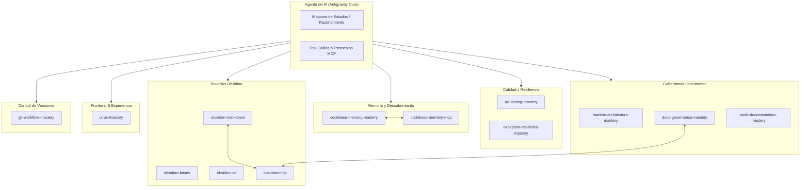

# Antigravity Governance Skills — Ecosistema de Gobernanza y Habilidades para Agentes de IA

[](LICENSE)
[](#instalación-y-configuración)
[](#instalación-y-configuración)
[](#visión-general-y-motivación)
[](https://github.com/RichardLitt/standard-readme)

Suite integral de habilidades operativas, directrices arquitectónicas, reglas de gobernanza y herramientas de auditoría para agentes de inteligencia artificial en el entorno **Antigravity**. Diseñada bajo el principio de **cero confianza (Zero-Trust)** hacia suposiciones no verificadas y orientada a la erradicación de alucinaciones operativas en flujos de desarrollo de software.

---

## Tabla de Contenidos

- [Visión General y Motivación](#visión-general-y-motivación)
- [Arquitectura del Ecosistema de Skills](#arquitectura-del-ecosistema-de-skills)
- [Catálogo de Skills Nucleares Versionadas](#catálogo-de-skills-nucleares-versionadas)
  - [1. Gobernanza Arquitectónica y Documentación](#1-gobernanza-arquitectónica-y-documentación)
  - [2. Calidad, Testing y Resiliencia](#2-calidad-testing-y-resiliencia)
  - [3. Memoria de Código y Grafos de Conocimiento](#3-memoria-de-código-y-grafos-de-conocimiento)
  - [4. Ecosistema Obsidian y Gestión de Bóvedas](#4-ecosistema-obsidian-y-gestión-de-bóvedas)
  - [5. Craft de Interacción y Experiencia de Usuario](#5-craft-de-interacción-y-experiencia-de-usuario)
  - [6. Control de Versiones Avanzado](#6-control-de-versiones-avanzado)
- [Skills Externas y de Terceros](#skills-externas-y-de-terceros)
- [Instalación y Configuración](#instalación-y-configuración)
  - [Autoconfiguración Asistida por Agente](#autoconfiguración-asistida-por-agente)
  - [Requisitos del Sistema](#requisitos-del-sistema)
  - [Despliegue Manual en el Entorno Global](#despliegue-manual-en-el-entorno-global)
  - [Despliegue a Nivel de Proyecto (Workspace)](#despliegue-a-nivel-de-proyecto-workspace)
  - [Configuración de Servidores MCP Recomendada](#configuración-de-servidores-mcp-recomendada)
- [Guía de Uso y Activación](#guía-de-uso-y-activación)
- [Gobernanza Git y Contribución](#gobernanza-git-y-contribución)
- [Auditoría Automatizada](#auditoría-automatizada)
- [Licencia](#licencia)

---

## Visión General y Motivación

El desarrollo de software asistido por agentes de inteligencia artificial requiere un marco estricto de restricciones, contratos y procedimientos deterministas. Sin límites explícitos, los modelos de lenguaje tienden a incurrir en:
- Drift documental y código muerto.
- Violación silenciosa de límites arquitectónicos (ej. deep imports entre capas o slices).
- Commits monolíticos acumulativos que degradan la trazabilidad de Git.
- Falta de verificación empírica de contratos de red y persistencia.

Este repositorio proporciona un catálogo modular de **skills** que instruyen a los agentes en metodologías probadas de ingeniería de software:
1. **Modelo Zero-Trust**: Obligación de inspeccionar fuentes primarias (archivos, AST, tipos, bases de datos) antes de emitir cualquier afirmación o refactorización.
2. **Readme-Driven Development (RDD)** y arquitectura de documentación viva (arc42, Diátaxis, RFC 9457).
3. **Trunk-Based Development** con atomicidad cuantitativa estricta (100 a 400 LOC por commit).
4. **Resiliencia de Sistemas** y prevención de vulnerabilidades OWASP (A10:2025 y API7:2023).

> [!IMPORTANT]
> **Principio Cardinal de Evidencia Empírica**: Toda decisión de arquitectura, propuesta de código o afirmación sobre el estado de un proyecto debe basarse en la lectura e inspección directa de fuentes primarias, evitando cualquier inferencia o suposición de memoria.

---

## Arquitectura del Ecosistema de Skills



---

## Catálogo de Skills Nucleares Versionadas

El repositorio contiene **11 skills nucleares** gestionadas bajo control de versiones, organizadas en 6 dimensiones de especialización:

### 1. Gobernanza Arquitectónica y Documentación

#### [readme-architecture-mastery](readme-architecture-mastery/SKILL.md)
- **Propósito**: Audita de forma exhaustiva y estandariza la calidad estructural, técnica, visual y de seguridad de archivos `README.md`, `AGENTS.md`, `CLAUDE.md` y `llms.txt`.
- **Capacidades Clave**:
  - Evaluación de 7 dimensiones técnicas (standard-readme, divergencia de dominio, GFM avanzado, doc-testing, adaptabilidad para agentes y seguridad de cadena de suministro).
  - Detección de caracteres invisibles zero-width, patrones de anulación o evasión de instrucciones del sistema, tuberías de ejecución directa y Base64 de longitud anómala (ClawHavoc).
  - Validador determinista CLI ejecutable en Deno (`scripts/validate_readme.ts`) con modo `--fix`.
- **Referencias**: [standard-readme spec](readme-architecture-mastery/references/01-standard-readme-spec.md), [matriz de divergencia](readme-architecture-mastery/references/02-domain-divergence-matrix.md), [seguridad y manifiestos IA](readme-architecture-mastery/references/05-ai-manifests-and-security.md).

#### [docs-governance-mastery](docs-governance-mastery/SKILL.md)
- **Propósito**: Administra y audita la base de conocimiento y documentación técnica combinando la estructura arquitectónica de **arc42** (12 capítulos, ISO/IEC/IEEE 42010) con los 4 cuadrantes de **Diátaxis** y grafos en Obsidian.
- **Capacidades Clave**:
  - Protocolo de auditoría integral en 8 dimensiones con reportes persistidos en `docs/auditorias/AUDIT-{NNN}-*.md`.
  - Generación de Architecture Decision Records (ADRs) bajo formato Nygard.
  - Diagramación viva exclusivamente en Mermaid.js.
  - Preparación agéntica para RAG y LLM Wiki (heading-aware chunking H1->H2->H3).
- **Referencias**: [guía de capítulos arc42](docs-governance-mastery/references/arc42-chapters-guide.md), [cuadrantes Diátaxis](docs-governance-mastery/references/diataxis-quadrants-guide.md), [esquemas frontmatter](docs-governance-mastery/references/frontmatter-schemas.md).

#### [code-documentation-mastery](code-documentation-mastery/SKILL.md)
- **Propósito**: Estandariza la documentación in-code y contratos de API pública con criterio de ingeniería de software.
- **Capacidades Clave**:
  - Orden canónico de etiquetas JSDoc/TSDoc (`@module`, `@param`, `@returns`, `@throws`, `@example`, `@since`, `@deprecated`).
  - Documentación de APIs públicas en barriles `index.ts` para arquitecturas modulares (Feature-Sliced Design y Clean Architecture).
  - Principio del "Por Qué": el bloque `/** */` documenta el contrato y la intención de negocio; los comentarios regulares `//` explican la implementación interna.
- **Referencias**: [contratos en APIs públicas](code-documentation-mastery/references/modular-public-api-contracts.md), [tipado JS puro](code-documentation-mastery/references/tipado-javascript-puro.md), [decisión JSDoc vs TSDoc](code-documentation-mastery/references/decision-jsdoc-vs-tsdoc.md).

---

### 2. Calidad, Testing y Resiliencia

#### [qa-testing-mastery](qa-testing-mastery/SKILL.md)
- **Propósito**: Auditoría de suites de prueba, detección dinámica del stack del proyecto y diseño de matrices agresivas de casos extremos (*edge cases*) bajo el paradigma del **Diamante de Pruebas**.
- **Capacidades Clave**:
  - Auto-detección de runtime (Deno, Node, Bun, Python, Rust, Go), ORM/drivers y runners (Vitest, Jest, Deno Test, Pytest).
  - Aislamiento transaccional ultra-rápido con rollbacks automáticos en `afterEach` (CLS / transacciones de prueba).
  - Detección de fallas críticas de dialecto (ej. SQLite en memoria para simular PostgreSQL en producción).
  - Pruebas de contrato CDC con Pact.js v3 y pruebas de carga con SLOs en k6/Autocannon.
- **Referencias**: [diamante de pruebas](qa-testing-mastery/references/testing-diamond-framework.md), [matriz de edge cases](qa-testing-mastery/references/edge-case-matrix-catalog.md), [recetas técnicas](qa-testing-mastery/references/tech-stacks-recipes.md).

#### [exception-resilience-mastery](exception-resilience-mastery/SKILL.md)
- **Propósito**: Evaluación forense, mitigación de fallos y resiliencia arquitectónica en el manejo de excepciones de extremo a extremo.
- **Capacidades Clave**:
  - Verificación del principio Fail-Closed y prevención de fugas de información interna en respuestas HTTP (OWASP A10:2025 y API7:2023).
  - Estandarización de respuestas de error bajo RFC 9457 (`application/problem+json`).
  - Observabilidad con W3C Trace Context (`traceparent`) y redacción obligatoria de PII en logs.
  - Algoritmos de reintento con Exponential Backoff y Jitter, Circuit Breakers y Error Boundaries en frontend.
- **Referencias**: [estándar RFC 9457](exception-resilience-mastery/references/rfc-9457-problem-details.md), [jerarquía de excepciones](exception-resilience-mastery/references/deno2-exception-hierarchy.md), [redacción PII y observabilidad](exception-resilience-mastery/references/pii-redaction-and-observability.md).

---

### 3. Memoria de Código y Grafos de Conocimiento

#### [codebase-memory-mastery](codebase-memory-mastery/SKILL.md)
- **Propósito**: Recetario operativo y protocolos de explotación del servidor `codebase-memory-mcp` para análisis estructural de código fuente.
- **Capacidades Clave**:
  - Análisis de radio de impacto (*blast radius*) con `detect_changes` antes de refactorizaciones o Pull Requests.
  - Detección de hotspots de complejidad ciclomática y cognitiva mediante consultas Cypher (`query_graph`).
  - Trazabilidad de flujo de datos (`trace_path` con `mode: data_flow` o `cross_service`).
  - Diagnóstico arquitectónico automatizado de ciclos y fronteras de módulos (`get_architecture`).
- **Referencias**: [parámetros de herramientas](codebase-memory-mastery/references/parametros-herramientas.md), [recetas Cypher avanzadas](codebase-memory-mastery/references/recetas-cypher-avanzadas.md).

---

### 4. Ecosistema Obsidian y Gestión de Bóvedas

#### [obsidian-markdown](obsidian-markdown/SKILL.md)
- **Propósito**: Creación y edición estructurada de notas en formato Obsidian Flavored Markdown.
- **Capacidades Clave**: Enlaces internos bidireccionales (`[[Nota]]`, `[[Nota#Encabezado]]`, `[[Nota#^bloque]]`), transclusiones e incrustaciones (`![[Nota]]`, `![[imagen.png]]`), alertas y callouts semánticos (`> [!note]`, `> [!warning]`), frontmatter YAML y diagramas Mermaid.
- **Referencias**: [propiedades YAML](obsidian-markdown/references/PROPERTIES.md), [incrustaciones](obsidian-markdown/references/EMBEDS.md), [catálogo de callouts](obsidian-markdown/references/CALLOUTS.md).

#### [obsidian-bases](obsidian-bases/SKILL.md)
- **Propósito**: Modelado y configuración de vistas de base de datos relacionales en archivos `.base` para Obsidian.
- **Capacidades Clave**: Configuración de vistas (tabla, cartas, lista, mapa), filtros booleanos anidados (`and`, `or`, `not`), fórmulas dinámicas de cálculo y sumarios matemáticos/temporales.
- **Referencias**: [referencia completa de funciones y fórmulas](obsidian-bases/references/FUNCTIONS_REFERENCE.md).

#### [obsidian-cli](obsidian-cli/SKILL.md)
- **Propósito**: Automatización de operaciones en la bóveda e inspección de desarrollo de plugins mediante la herramienta de línea de comandos de Obsidian.
- **Capacidades Clave**: Creación y lectura de notas por CLI, actualización de propiedades, recarga de plugins (`obsidian plugin:reload`), captura de errores de consola y ejecución de JavaScript en el contexto de la aplicación.

---

### 5. Craft de Interacción y Experiencia de Usuario

#### [ui-ux-mastery](ui-ux-mastery/SKILL.md)
- **Propósito**: Arquitectura de interfaces, razonamiento UX de nivel senior y ejecución cinético-estética de componentes frontend.
- **Capacidades Clave**:
  - Erradicación del antipatrón *Database-Shaped UI*; diseño centrado en la intención del usuario.
  - Modelado de componentes con Máquinas de Estados Finitas (FSM) discretas (`idle` | `loading` | `success` | `error`).
  - Catálogo de 41 patrones de interacción, reglas del Umbral Doherty (<400ms) y accesibilidad WCAG 2.1 AA/AAA.
  - Presupuesto estricto de 120 FPS: animación exclusiva de `transform` y `opacity`, resortes amortiguados con `linear()` y respeto a `prefers-reduced-motion`.
- **Referencias**: [catálogo de 41 patrones](ui-ux-mastery/references/cheatsheet-41-patrones.md), [patrones FSM](ui-ux-mastery/references/fsm-patterns.md), [tokens de movimiento](ui-ux-mastery/references/motion-tokens.md), [accesibilidad y métricas](ui-ux-mastery/references/accesibilidad-y-metricas.md).

---

### 6. Control de Versiones Avanzado

#### [git-workflow-mastery](git-workflow-mastery/SKILL.md)
- **Propósito**: Operaciones avanzadas de Git de bajo nivel y arquitectura de control de versiones para desarrollo colaborativo.
- **Capacidades Clave**:
  - Inyección topológica de ramas apiladas (*stacked branches*) con `git rebase --onto` y rebases sincronizados con `--update-refs`.
  - Ambientes de desarrollo y revisión aislados y concurrentes mediante `git worktree`.
  - Reutilización de resoluciones de conflicto con `git rerere`.
  - Auditoría de reescritura de historial ("diff de diffs") mediante `git range-diff`.
- **Referencias**: [fundamentos DAG](git-workflow-mastery/references/fundamentos-dag.md), [herramientas avanzadas](git-workflow-mastery/references/herramientas-avanzadas.md), [Trunk-Based Development](git-workflow-mastery/references/trunk-based-development.md), [Conventional Commits](git-workflow-mastery/references/conventional-commits.md).

---

## Skills Externas y de Terceros

Las siguientes 3 habilidades complementarias están configuradas en el entorno local del usuario pero se encuentran **excluidas deliberadamente del control de versiones** del repositorio a través de [`.gitignore`](.gitignore), ya que corresponden a herramientas de terceros o paquetes desacoplados:

| Carpeta Ignorada | Herramienta / Utilidad | Función Principal |
| :--- | :--- | :--- |
| `defuddle/` | Defuddle CLI | Extracción de contenido web limpio en Markdown eliminando anuncios y navegación para optimizar consumo de tokens. |
| `graphify/` | Graphify Engine | Construcción de grafos de conocimiento multimodal, detección de comunidades Louvain y consultas GraphRAG. |
| `json-canvas/` | JSON Canvas Spec | Especificación abierta JSON Canvas 1.0 para creación y edición programática de archivos espaciales `.canvas`. |

---

## Instalación y Configuración

### Autoconfiguración Asistida por Agente

Puedes delegar la instalación, clonación y verificación de este catálogo directamente a tu agente de IA (Antigravity u otro agente con acceso a terminal y Git). Proporciónale el siguiente prompt:

> [!TIP]
> **Prompt para el Agente:**
> ```text
> Configura e integra el catálogo de skills de gobernanza desde el repositorio oficial:
> https://github.com/EdwinDragusin/agent-core-skills.git
> 
> Sigue estos pasos para la instalación:
> 1. Detecta el sistema operativo y el directorio de usuario ($HOME o %USERPROFILE%).
> 2. Determina el alcance deseado:
>    - Despliegue Global (predeterminado): Clona el repositorio en la carpeta global de skills de Antigravity:
>      - Windows (PowerShell): "$HOME\.gemini\config\skills"
>      - macOS / Linux: "$HOME/.gemini/config/skills"
>      (Si el directorio ya existe y contiene un repositorio Git, realiza un `git pull origin main` para sincronizar la versión más reciente; de lo contrario, clónalo).
>    - Despliegue por Proyecto (Workspace): Clona o copia las skills en la carpeta `.agents/skills/` en la raíz del proyecto actual.
> 3. Entorno agnóstico: Este catálogo es completamente independiente del lenguaje o runtime (compatible con proyectos en Node.js, Python, Go, Rust, Java, C#, PHP, Deno o Bun). No asumas dependencias exclusivas de un solo runtime.
> 4. Comprueba la integridad inspeccionando que los archivos `SKILL.md` estén presentes y reporta la lista de skills habilitadas.
> ```

Repositorio oficial: [EdwinDragusin/agent-core-skills](https://github.com/EdwinDragusin/agent-core-skills) (URL de clonación: `https://github.com/EdwinDragusin/agent-core-skills.git`).

### Requisitos del Sistema

- **Stack y Lenguajes**: Agnóstico y universal. Las skills contienen especificaciones arquitectónicas, directrices operativas y protocolos en Markdown que gobiernan el razonamiento de los agentes en cualquier stack de programación (Node.js, TypeScript/JavaScript, Python, Go, Rust, C#, PHP, Java, bases de datos SQL/NoSQL, etc.).
- **Control de Versiones**: Git 2.38+ (para clonación, sincronización y soporte nativo de ramas apiladas y rebases avanzados).
- **Plataforma de Agentes**: Google Antigravity o asistentes de IA compatibles con el protocolo de Skills y Customizaciones (`~/.gemini/config/skills` o `.agents/skills`).

### Despliegue Manual en el Entorno Global

Para que Antigravity reconozca este catálogo de forma global en todas tus sesiones y proyectos, clona el repositorio en el directorio de configuración del usuario:

```bash
# En Windows (PowerShell)
git clone https://github.com/EdwinDragusin/agent-core-skills.git "$HOME\.gemini\config\skills"

# En macOS / Linux
git clone https://github.com/EdwinDragusin/agent-core-skills.git "$HOME/.gemini/config/skills"
```

### Despliegue a Nivel de Proyecto (Workspace)

Si deseas incorporar estas habilidades únicamente en un proyecto específico para compartirlas con tu equipo mediante control de versiones:

```bash
# Crear directorio de skills del proyecto
mkdir -p .agents/skills

# Clonar o incorporar el repositorio
git clone https://github.com/EdwinDragusin/agent-core-skills.git .agents/skills
```

### Configuración de Servidores MCP Recomendada

Para habilitar la interoperabilidad de las skills de memoria estructural y documentación en Obsidian, configurar los servidores en `mcp_config.json`:

```json
{
  "mcpServers": {
    "codebase-memory-mcp": {
      "command": "npx",
      "args": ["-y", "codebase-memory-mcp"]
    },
    "obsidian": {
      "command": "npx",
      "args": ["-y", "@bitbonsai/mcpvault"]
    }
  }
}
```

---

## Guía de Uso y Activación

Las skills operan bajo un modelo híbrido de **activación contextual autónoma** y **ejecución explícita**:

### Activación Autónoma por Escenario

| Tarea que Realiza el Agente | Skills Activadas Automáticamente |
| :--- | :--- |
| Creación o edición de `README.md` / `AGENTS.md` | `readme-architecture-mastery` |
| Creación de notas de arquitectura, ADRs o guías | `docs-governance-mastery`, `obsidian-markdown` |
| Documentación de funciones, tipos o APIs públicas | `code-documentation-mastery` |
| Diagnóstico de fallos, refactorings o Pull Requests | `codebase-memory-mastery`, `exception-resilience-mastery` |
| Creación de suites de pruebas o diagnóstico de CI | `qa-testing-mastery` |
| Diseño de componentes visuales o pantallas UI | `ui-ux-mastery` |
| Planificación de ramas, commits, rebases o merges | `git-workflow-mastery` |

### Invocación Manual y Ejemplos de Prompt

```markdown
# Auditoria de documentacion
"Audita el README.md de este proyecto bajo las 7 dimensiones tecnicas y verifica si hay anclas rotas."

# Auditoria de excepciones
"Ejecuta una auditoria de resiliencia y manejo de excepciones en la capa de aplicacion verificando el cumplimiento de RFC 9457."

# Diseno de pruebas y edge cases
"Disena una matriz de casos extremos para el modulo de pagos y genera pruebas con aislamiento transaccional."
```

---

## Gobernanza Git y Contribución

Todo cambio o adición a este repositorio debe respetar las siguientes normas de gobernanza:

1. **Trunk-Based Development**: Ramas de vida corta enfocadas en incrementos cohesivos. Prohibido el auto-merge directo a `main`.
2. **Atomicidad de Commits**:
   - Cada commit debe representar un incremento de **100 a 400 LOC** (límite estricto de 500 LOC).
   - Prohibidos los commits monolíticos acumulativos (`git add .` indiscriminado).
3. **Formato Conventional Commits**:
   ```
   <tipo>(<alcance>): <descripcion imperativa en espanol>
   ```
   *Ejemplos:*
   - `feat(readme): anadir regla de deteccion de curlbash`
   - `docs(arc42): actualizar guia de capitulo 5 para arquitecturas FSD`
   - `fix(qa): corregir rollback transaccional en pruebas de integracion`
4. **Prohibición Total de Emojis**: Cero emojis en mensajes de commit, cuerpos de Pull Requests, código fuente o documentación técnica.

---

## Auditoría Automatizada

El repositorio incluye herramientas deterministas para auditar y auto-corregir la documentación:

### Validar README.md con Deno

```bash
# Escaneo estatico de cumplimiento
deno run --allow-read ./readme-architecture-mastery/scripts/validate_readme.ts ./README.md

# Modo de auto-remediacion segura (repara alertas GFM y caracteres invisibles)
deno run --allow-read --allow-write ./readme-architecture-mastery/scripts/validate_readme.ts --fix ./README.md
```

---

## Licencia

Este proyecto está bajo la Licencia MIT. Para más información, consultar el archivo de licencia correspondiente.

```text
SPDX-License-Identifier: MIT
```
