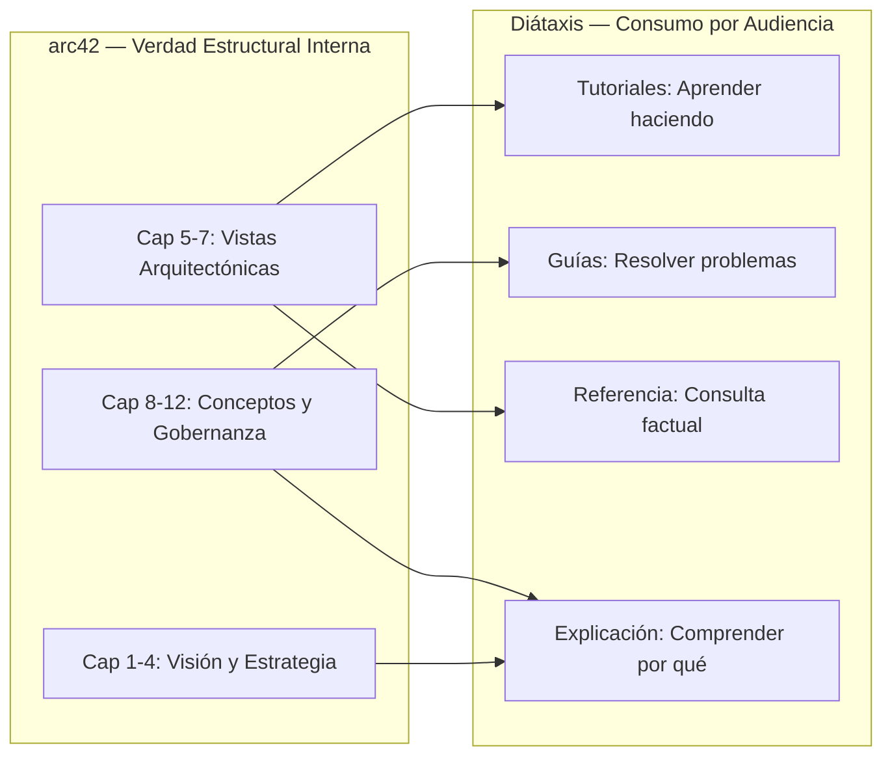
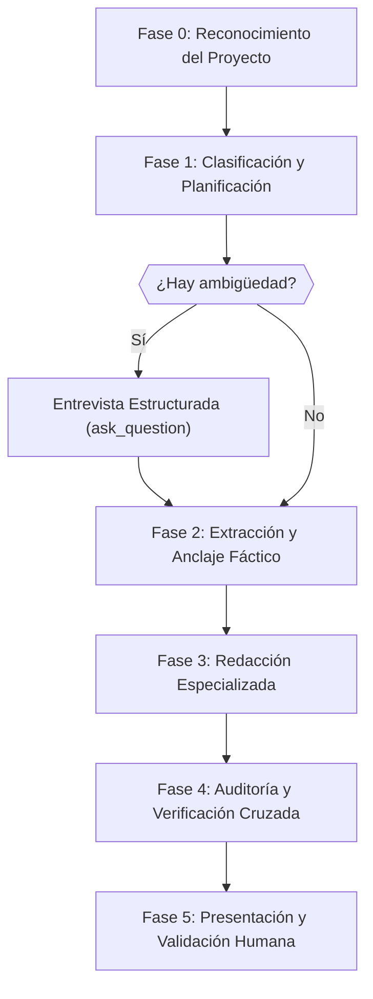

# Docs Governance Mastery — Gobernanza Documental con arc42, Diátaxis y Vaults de Obsidian

Skill para la gestión integral y auditoría del vault de documentación de proyectos de software,
combinando la estructura arquitectónica de **arc42** (12 capítulos, ISO/IEC/IEEE 42010) con la clasificación
cognitiva de **Diátaxis** (4 cuadrantes por necesidad del lector) y la higiene de grafos en **Obsidian**.

## Documentación de Referencia y Módulos de Conocimiento

Consulta los siguientes módulos para especificaciones técnicas detalladas:

*   **[Guía de Capítulos arc42](./references/arc42-chapters-guide.md)**: Los 12 capítulos, directrices de extracción, interdependencias, formato ADR Nygard, niveles de profundidad y plantillas Markdown.
*   **[Guía de Cuadrantes Diátaxis](./references/diataxis-quadrants-guide.md)**: Los 4 cuadrantes, reglas de estilo, heurísticas de clasificación y plantillas.
*   **[Esquemas de Frontmatter](./references/frontmatter-schemas.md)**: Esquemas canónicos de YAML frontmatter para validación estricta de documentos y compatibilidad con Dataview.
*   **[Salud del Grafo y Enlaces Obsidian](./references/obsidian-graph-health.md)**: Auditoría de enlaces bidireccionales, detección de notas huérfanas, enlaces rotos y MOCs.
*   **[Preparación para Agentes MCP / LLM Wiki](./references/mcp-agent-readiness.md)**: Heading-aware chunking, jerarquía H1->H2->H3, semántica para agentes y compatibilidad RAG.
*   **[Mapeo SDLC-Ágil](./references/sdlc-mapping.md)**: Intervención por fase del ciclo de vida, triggers de activación y artefactos esperados.
*   **[Checklist de Auditoría](./references/audit-checklist.md)**: Validaciones cruzadas, detección de deriva arquitectónica y formato de reportes de auditoría.

---

## Principios Fundamentales

### Modelo Dual: arc42 + Diátaxis



- **arc42** es el sistema de registro de la verdad arquitectónica del proyecto
  (para arquitectos e ingenieros internos).
- **Diátaxis** rige el consumo interactivo del conocimiento (para usuarios,
  operadores y desarrolladores consumidores).
- La documentación NO es un texto monolítico; es una colección de vistas
  interconectadas clasificadas por propósito cognitivo.

### Nivel de Profundidad por Defecto

El agente opera en nivel **Essential** (~10-15 páginas por proyecto):

| Nivel | Páginas | Uso |
|:------|:--------|:----|
| Lean | 3-5 | Proyectos pequeños, prototipos, POCs |
| **Essential** | **10-15** | **Default. Proyectos medianos y grandes** |
| Thorough | 30+ | Sistemas críticos, regulados, certificaciones |

### Idioma

Toda documentación generada DEBE redactarse en **español**.

### Diagramas como Código

Para representar visualmente bloques de construcción, contextos, despliegues y
flujos de ejecución:

> [!IMPORTANT]
> **Usar exclusivamente Mermaid.** No generar Structurizr DSL, PlantUML ni
> imágenes directas. Obsidian renderiza Mermaid nativamente. Los diagramas se
> incrustan directamente en los documentos Markdown del vault.

### Gestión Documental vía Obsidian MCP

Toda interacción con los documentos del proyecto DEBE realizarse mediante las
herramientas del servidor MCP de Obsidian:

- **Lectura**: `read_note`, `read_multiple_notes`, `search_notes`,
  `get_notes_info`, `get_note_outline`
- **Escritura**: `write_note`, `patch_note`, `update_frontmatter`
- **Organización**: `move_note`, `manage_tags`

> [!WARNING]
> Prohibido crear/editar notas de documentación con herramientas genéricas de
> archivos (`write_to_file`, `replace_file_content`) sin pasar por Obsidian MCP.
> Esto garantiza la integridad del vault y los enlaces bidireccionales.

---

## Flujo de Trabajo en 6 Fases

Cuando se invoque esta skill, ejecutar las siguientes fases en orden estricto:



---

### Fase 0: Reconocimiento del Proyecto (Zero-Trust)

> [!IMPORTANT]
> **Principio Zero-Trust**: No asumir estructura, tecnologías ni estado de la
> documentación existente. Inspeccionar directamente antes de afirmar.

1.  **Detectar estructura documental existente**:
    -   Buscar en el vault de Obsidian carpetas como `docs/`, `arquitectura/`,
        `adr/`, `guias/`, `referencia/`, `tutoriales/` usando `list_directory`
        y `search_notes`.
    -   Identificar si existe documentación arc42 previa (buscar secciones
        como "Introducción y Metas", "Vista de Bloques", "Decisiones
        Arquitectónicas").
    -   Detectar ADRs existentes y su formato/numeración.

2.  **Auditar tecnologías del proyecto**:
    -   Leer `package.json`, `go.mod`, `Cargo.toml`, `requirements.txt`,
        `pom.xml` o equivalente para identificar stack tecnológico.
    -   Detectar manifiestos IaC: `Dockerfile`, `docker-compose.yml`,
        `*.tf`, `k8s/`, `helm/`.
    -   Identificar frameworks de testing, linters y CI/CD configurados.

3.  **Evaluar madurez documental**:
    -   Contar capítulos arc42 con contenido vs vacíos.
    -   Verificar cobertura de cuadrantes Diátaxis.
    -   Calcular antigüedad de la última actualización documental.
    -   Generar un diagnóstico inicial: `{sin_documentacion | parcial | completa}`.

4.  **Indexar el grafo de código**:
    -   Ejecutar `index_repository` de `codebase-memory-mcp` si no hay índice
        reciente.
    -   Usar `get_architecture` para obtener visión macro del proyecto.

---

### Fase 1: Clasificación y Planificación

Determinar qué capítulos de arc42 y cuadrantes de Diátaxis requieren atención
según la solicitud del usuario y la fase actual del SDLC.

1.  **Identificar fase SDLC actual**:
    -   Consultar `references/sdlc-mapping.md` para determinar qué artefactos
        corresponden a la fase activa.

2.  **Clasificar la solicitud del usuario**:
    -   ¿Es una solicitud de documentación nueva (inicialización)?
    -   ¿Es una actualización tras cambios en el código?
    -   ¿Es una auditoría del estado actual?
    -   ¿Es un registro de decisión arquitectónica?
    -   ¿Es documentación orientada al usuario (Diátaxis)?

3.  **Protocolo de Clarificación Automática**:

> [!IMPORTANT]
> **Entrevista Estructurada Automática**: Cuando el agente detecte ambigüedad
> sobre qué documentar, cómo clasificar contenido, o qué rumbo tomar, DEBE
> lanzar automáticamente una sesión de clarificación usando la herramienta
> `ask_question`. NO esperar a que el usuario invoque `/grill-me`.

**Triggers de clarificación automática** (lanzar `ask_question` si se cumple
alguno):

-   La solicitud del usuario puede mapearse a más de un cuadrante Diátaxis.
-   No queda claro si el contenido debe ir en arc42 o en Diátaxis.
-   Hay decisiones arquitectónicas implícitas que no han sido formalizadas.
-   El alcance de la documentación solicitada es ambiguo.
-   Existen conflictos entre restricciones documentadas y la realidad del código.
-   El usuario menciona múltiples capítulos/secciones sin priorizar.

**Formato de la entrevista estructurada**:

```
ask_question con preguntas como:
- "¿Este contenido está dirigido a usuarios finales (Tutorial/Guía) o a
   arquitectos/ingenieros internos (arc42)?"
- "¿El objetivo es enseñar (Tutorial), resolver un problema específico
   (Guía), documentar APIs (Referencia) o explicar decisiones (Explicación)?"
- "¿La audiencia ya conoce el sistema o está aprendiendo?"
- "¿Esta decisión debe registrarse como ADR formal?"
```

El agente debe formular entre 2 y 5 preguntas específicas por sesión de
clarificación, no más.

---

### Fase 2: Extracción y Anclaje Fáctico

> [!WARNING]
> **Prevención de Alucinaciones Operativas**: El agente tiene PROHIBIDO generar
> contenido documental a partir de conocimiento paramétrico interno. Todo dato
> debe extraerse empíricamente del código, configuraciones y artefactos reales.

1.  **Extracción de datos empíricos** (según capítulo/cuadrante objetivo):

    | Fuente | Herramienta | Datos Extraídos | Destino |
    |:-------|:------------|:----------------|:--------|
    | Código fuente | `search_graph`, `trace_path`, `get_code_snippet` | Componentes, dependencias, interfaces | Cap 5, Referencia |
    | APIs | `search_graph`, lectura de archivos OpenAPI/Swagger | Endpoints, parámetros, respuestas | Referencia |
    | Manifiestos IaC | `read_note` o lectura directa de `.tf`, `k8s/` | Nodos, pods, redes | Cap 7 |
    | Tests | `search_code`, `grep_search` | Escenarios de uso, cobertura | Cap 10 |
    | Git history | `git log`, análisis de PRs | Decisiones, cambios arquitectónicos | Cap 9 (ADRs) |
    | Código repetitivo | `search_code`, `query_graph` | Patrones transversales | Cap 8 |
    | FIXME/TODO | `grep_search("FIXME\|TODO")` | Deuda técnica | Cap 11 |

2.  **Validación de restricciones**:
    -   Leer Cap 2 (Restricciones) si existe.
    -   Verificar que ningún dato extraído contradiga las restricciones
        documentadas.
    -   Si hay contradicción, emitir **alerta de deriva arquitectónica**.

---

### Fase 3: Redacción Especializada

Generar el contenido aplicando las restricciones correspondientes según el
destino:

#### Si el destino es un capítulo arc42:

-   Consultar `references/arc42-chapters-guide.md` para las directrices
    específicas del capítulo.
-   Aplicar nivel **Essential** (default) para la profundidad.
-   Generar diagramas en **Mermaid** para los capítulos 3, 5, 6 y 7.
-   Para Cap 9 (ADRs): usar formato Nygard obligatorio.
-   Mantener el grafo de dependencias entre capítulos: si se modifica Cap 5,
    verificar impacto en Cap 3, Cap 6 y Cap 7.

#### Si el destino es un cuadrante Diátaxis:

-   Consultar `references/diataxis-quadrants-guide.md` para las reglas de
    estilo y estructura del cuadrante.
-   Aplicar las barreras estrictas entre cuadrantes.
-   Para **Referencia**: extraer SOLO datos factuales del código. PROHIBIDO
    generar parámetros, clases o respuestas HTTP de memoria.
-   Para **Tutoriales**: flujo lineal, sin alternativas, con indicadores de
    retroalimentación ("La salida esperada es Z").
-   Para **Guías de Uso**: pasos imperativos, sin teoría.
-   Para **Explicación**: narrativa de "¿por qué?", sintetizar ADRs y
    decisiones de diseño.

#### Redacción en Obsidian:

-   Usar `write_note` para documentos nuevos.
-   Usar `patch_note` para actualizaciones parciales.
-   Usar `update_frontmatter` para metadatos (tags, estado, fecha).
-   Usar `manage_tags` para clasificación semántica.
-   Incluir wikilinks (`[[nota-relacionada]]`) para interconectar documentos.

---

### Fase 4: Auditoría y Verificación Cruzada (Linting Semántico)

> [!IMPORTANT]
> Esta fase es OBLIGATORIA antes de presentar cualquier artefacto documental.
> Consultar `references/audit-checklist.md` para el procedimiento completo.

1.  **Consistencia arc42**:
    -   Todo bloque en Cap 5 que interactúe con sistema externo DEBE existir
        en Cap 3.
    -   Todo participante en diagramas de secuencia (Cap 6) DEBE existir
        como bloque en Cap 5.
    -   Toda estrategia (Cap 4) DEBE vincular a una meta de calidad (Cap 1.2).
    -   Todo componente desplegado (Cap 7) DEBE existir en Cap 5.
    -   Toda restricción (Cap 2) DEBE respetarse en Cap 4 y Cap 7.

2.  **Barreras Diátaxis**:
    -   Verificar que el contenido generado NO transgrede las fronteras de su
        cuadrante asignado.

3.  **Deriva arquitectónica**:
    -   Comparar componentes documentados con módulos reales del código usando
        `search_graph` y `check_index_coverage`.
    -   Detectar componentes fantasma (en código, no en docs) y documentación
        zombie (en docs, no en código).

4.  **Linting del glosario**:
    -   Verificar que toda terminología usada en la documentación generada sea
        consistente con el Glosario (Cap 12).

5.  **Persistencia del reporte de auditoría**:
    -   Si se ejecutó una auditoría completa, persistir el reporte en
        `docs/auditorias/AUDIT-{NNN}-documentacion.md` del proyecto vía
        Obsidian MCP, siguiendo el formato estándar de la regla global de
        auditorías.

---

### Fase 5: Presentación y Validación Humana (HITL)

> [!WARNING]
> El agente NO DEBE fusionar documentación en la base documental sin
> aprobación explícita del usuario.

1.  **Presentar artefactos**:
    -   Mostrar un resumen del contenido generado/modificado.
    -   Listar los archivos creados o editados con enlaces directos.
    -   Destacar decisiones tomadas y supuestos asumidos.

2.  **Solicitar aprobación**:
    -   Si se generaron ADRs, presentarlos como borradores para revisión.
    -   Si se detectaron alertas de deriva, reportarlas explícitamente.
    -   Si se identificaron dudas no resueltas, lanzar entrevista estructurada
        (`ask_question`) antes de finalizar.

3.  **Registrar el evento**:
    -   Actualizar el frontmatter de los documentos modificados con la fecha
        de última actualización vía `update_frontmatter`.

---

## Estructura de Documentación Recomendada en el Vault

Cuando se inicialice la documentación de un proyecto nuevo, proponer la
siguiente estructura de directorios en el vault de Obsidian:

```
docs/
├── arquitectura/
│   ├── 01-introduccion-y-metas.md
│   ├── 02-restricciones.md
│   ├── 03-contexto-y-alcance.md
│   ├── 04-estrategia-de-solucion.md
│   ├── 05-vista-bloques-construccion.md
│   ├── 06-vista-tiempo-ejecucion.md
│   ├── 07-vista-despliegue.md
│   ├── 08-conceptos-transversales.md
│   ├── 09-decisiones-arquitectonicas.md
│   ├── 10-requisitos-de-calidad.md
│   ├── 11-riesgos-y-deuda-tecnica.md
│   └── 12-glosario.md
├── adr/
│   ├── ADR-001-seleccion-base-datos.md
│   ├── ADR-002-patron-autenticacion.md
│   └── ...
├── tutoriales/
│   └── ...
├── guias/
│   └── ...
├── referencia/
│   └── ...
├── explicacion/
│   └── ...
└── auditorias/
    ├── AUDIT-001-inicializacion.md
    └── ...
```

---

## Reglas de Honestidad y Anti-Alucinación

1.  **Nunca inventar firmas de funciones, parámetros de API, entidades de
    dominio o dependencias**. Si no se puede verificar empíricamente, declararlo
    como "[PENDIENTE DE VERIFICACIÓN]".
2.  **Nunca generar contenido de Referencia Diátaxis sin tool-calling**. Toda
    información factual debe extraerse del código fuente real.
3.  **Siempre citar la fuente primaria** (ruta de archivo y rango de líneas)
    cuando se documente un componente o interfaz.
4.  **Declarar incertidumbre explícitamente** en lugar de rellenar vacíos con
    suposiciones plausibles.
5.  **Marcar contenido provisional** con el tag `estado: borrador` en el
    frontmatter cuando la verificación humana esté pendiente.
6.  **Nunca asumir el estado de la documentación existente** sin leerla
    primero (principio Zero-Trust).

---

## Integración con el Ecosistema de Herramientas

### codebase-memory-mcp (Prioridad para descubrimiento de código)

| Escenario | Herramienta |
|:-----------|:-----------|
| Encontrar componentes para Cap 5 | `search_graph(name_pattern="...")` |
| Trazar dependencias para Cap 3/6 | `trace_path(function_name="...", direction="...")` |
| Leer implementación real | `get_code_snippet(qualified_name="...")` |
| Detectar ciclos y fronteras | `get_architecture(aspects=["cycles", "boundaries"])` |
| Verificar cobertura del índice | `check_index_coverage(paths=[...])` |
| Detectar cambios para ADRs | `detect_changes(base_branch="main", scope="impact")` |

### Obsidian MCP (Gestión del vault)

| Escenario | Herramienta |
|:-----------|:-----------|
| Crear documento nuevo | `write_note(path="docs/...", content="...")` |
| Actualizar sección | `patch_note(path="docs/...", ...)` |
| Buscar documentación existente | `search_notes(query="...")` |
| Actualizar metadatos | `update_frontmatter(path="docs/...", ...)` |
| Gestionar tags | `manage_tags(path="docs/...", ...)` |

### Git y CI/CD

-   Reindexar `codebase-memory-mcp` después de cada commit significativo.
-   Analizar PRs con `detect_changes` para generar borradores de ADRs.
-   Tras merge a `main`, verificar sincronización docs-código.

---

## Protocolo de Auditoría Integral del Vault (8 Dimensiones)

Cuando se solicite auditar el vault de documentación existente:

### 0. Arranque Incremental
- Identificar la fecha de la última auditoría en `docs/auditorias/`.
- Si existe auditoría previa, limitar el escaneo con `git log --since="<FECHA>"` a los archivos modificados.
- Si no existe previa, ejecutar auditoría completa.

### 1. Las 8 Dimensiones de Auditoría
1. **D1 — Cumplimiento arc42**: Cobertura de los 12 capítulos, sin vacíos ni omisiones estructurales.
2. **D2 — Ortogonalidad Diátaxis**: Clasificación sin cruces (`tutorial`, `how-to`, `referencia`, `explicacion`).
3. **D3 — Esquemas de Frontmatter YAML**: Validación contra [frontmatter-schemas.md](./references/frontmatter-schemas.md). Propiedades `id`, `titulo`, `estado`, `fecha`, `tags` y `diataxis-quadrant`.
4. **D4 — Grafo de Enlaces y Bidireccionalidad**: Cero enlaces rotos, detección de notas huérfanas, densidad saludable de enlaces (consultar [obsidian-graph-health.md](./references/obsidian-graph-health.md)).
5. **D5 — MOCs Dinámicos y Dataview**: Colecciones con >10 notas deben gobernarse mediante Maps of Content dinámicos con bloques `dataview`.
6. **D6 — Diagramación Viva (Mermaid Exclusivo)**: Prohibición de imágenes estáticas no versionables (PNG, Drawio). Todo diagrama debe ser código Mermaid renderizable.
7. **D7 — Higiene y Taxonomía**: Nomenclatura kebab-case, coherencia de tags, ausencia de duplicados.
8. **D8 — Preparación para Agentes (LLM Wiki)**: Heading-aware chunking (exactamente un H1 por nota, descenso estricto H1->H2->H3), semántica autocontenida (consultar [mcp-agent-readiness.md](./references/mcp-agent-readiness.md)).

### 2. Formato del Reporte Persistido
Guardar en `docs/auditorias/AUDIT-{NNN}-auditoria-vault-conocimiento.md`:
- Frontmatter estructurado (`id`, `titulo`, `tipo: auditoria`, `estado`, `fecha`, `autor`).
- Resumen ejecutivo con conteo por severidad (Crítico, Alto, Medio, Bajo).
- Tabla consolidada de hallazgos con rutas, líneas y acciones correctivas sugeridas.
- Cero emojis en reportes y artefactos generados.
