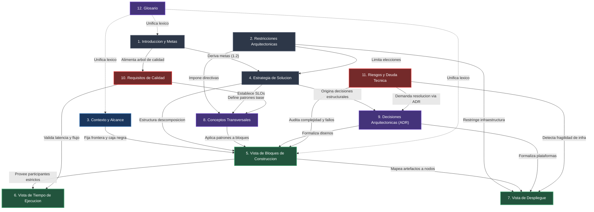
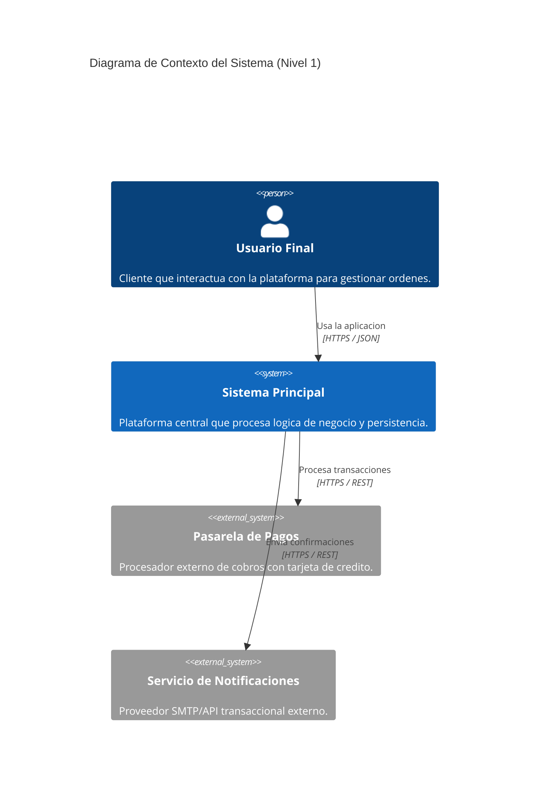
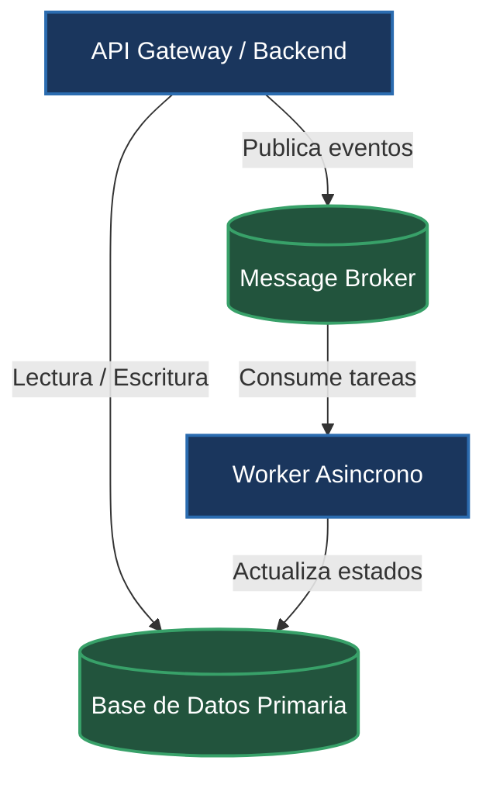
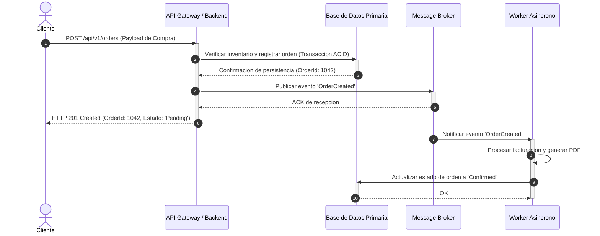
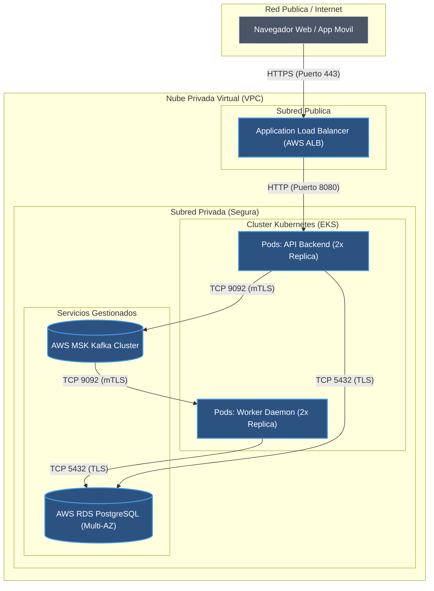
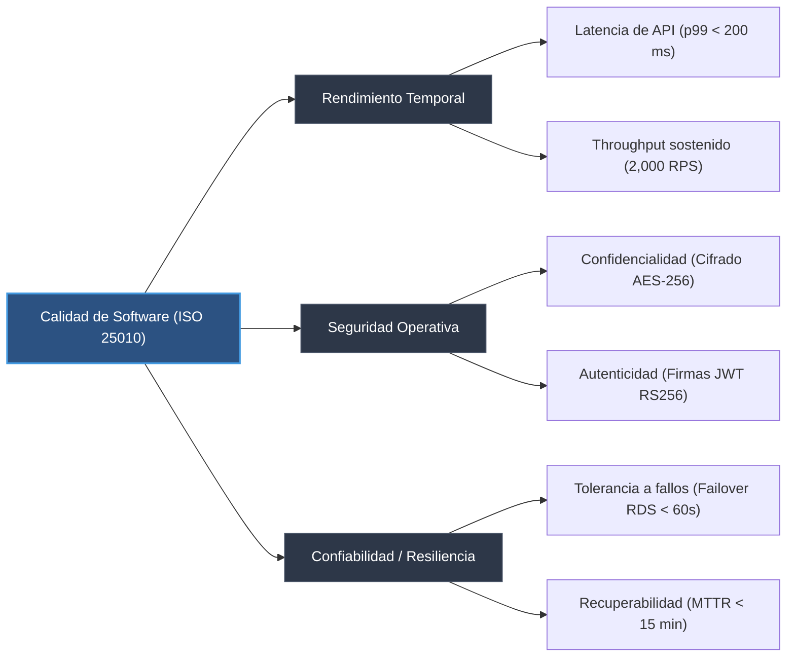
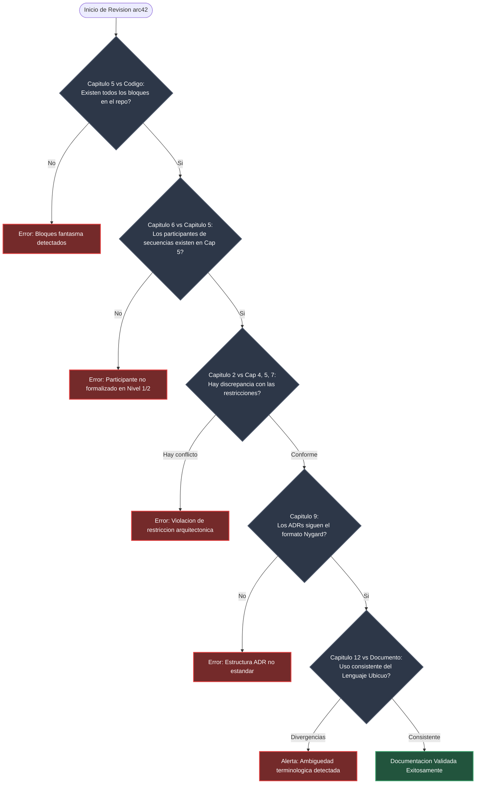

# Guía de Referencia de Capítulos arc42 para Agentes de IA

Esta guía establece las especificaciones operativas, directrices de extracción automatizada y reglas de validación cruzada para los 12 capítulos del estándar arc42. El contenido de este documento está destinado exclusivamente al procesamiento, generación y auditoría técnica por parte de agentes de IA dentro del marco de [[arc42-overview]] y [[diataxis-framework]].

---

## 1. Introducción y Fundamentos Normativos

El marco arc42 materializa el estándar internacional **ISO/IEC/IEEE 42010:2011** (Systems and software engineering — Architecture description), proporcionando una estructura de 12 contenedores lógicos invariables. Cada capítulo encapsula un aspecto ortogonal del sistema de software, asegurando separación de incumbencias (*separation of concerns*), completitud descriptiva y trazabilidad de requerimientos hacia la implementación.

> [!IMPORTANT]
> Los 12 capítulos de arc42 son invariables en su numeración, propósito y jerarquía lógica. El agente de IA tiene prohibido reordenar, fusionar o renombrar los capítulos. En arquitecturas donde una sección carezca de aplicabilidad temporal, el agente debe registrar una justificación explícita de omisión bajo el nivel Lean en lugar de suprimir el capítulo.

### Principios de Operación para el Agente
1. **Verificación Empírica Contra el Código**: Ninguna afirmación arquitectónica debe sustentarse en suposiciones; el agente debe corroborar cada componente, interfaz y protocolo contra el árbol de código fuente, los archivos de configuración y la infraestructura como código (IaC).
2. **Trazabilidad Bidireccional**: Toda decisión técnica (Capítulo 9) y estrategia de diseño (Capítulo 4) debe trazar directamente a una meta de calidad (Capítulo 1.2) o restricción (Capítulo 2).
3. **Consistencia Estricta de Nomenclatura**: Las entidades y componentes identificados deben conservar un nombre unívoco a través de todos los diagramas y tablas, validado contra el Glosario (Capítulo 12).

---

## 2. Matriz Maestra de Capítulos arc42

| Capítulo | Propósito | Directrices de Extracción para el Agente | Interdependencias |
| :--- | :--- | :--- | :--- |
| **1. Introducción y Metas** | Definir el problema de negocio, los objetivos esenciales de la solución, los 3 a 5 objetivos de calidad prioritarios y los stakeholders principales. | 1. Extraer requisitos esenciales desde especificaciones funcionales y `README.md`.<br>2. Formular de 3 a 5 metas de calidad siguiendo la taxonomía **ISO/IEC 25010** con métrica y umbral cuantificable.<br>3. Construir la tabla de stakeholders identificando roles, expectativas y puntos de contacto. | Fundamenta las decisiones de [[#Capítulo 4: Estrategia de Solución]] y los escenarios de [[#Capítulo 10: Requisitos de Calidad]]. |
| **2. Restricciones Arquitectónicas** | Registrar toda limitación técnica, organizacional, regulatoria o temporal impuesta que reduzca la libertad de diseño del equipo. | 1. Identificar directivas corporativas, licencias de software (`LICENSE`), marcos normativos (GDPR, HIPAA, PCI-DSS) y restricciones de plataforma.<br>2. Ejecutar validación cruzada: si una restricción impone un motor de base de datos específico, auditar Capítulos 4, 5, 7 y 8 para garantizar congruencia absoluta. | Restringe y condiciona las opciones disponibles en Capítulos 4, 5, 7 y 8. |
| **3. Contexto y Alcance** | Delimitar las fronteras del sistema, distinguiendo la caja negra propia de los usuarios externos y sistemas terceros. | 1. Generar un diagrama de contexto en formato Mermaid C4 Nivel 1.<br>2. Separar contextualmente la frontera en dos dimensiones:<br>&nbsp;&nbsp;a) **Contexto de Negocio**: intercambio semántico de datos y eventos de dominio.<br>&nbsp;&nbsp;b) **Contexto Técnico**: protocolos de transporte, puertos, formatos de serialización y políticas de autenticación.<br>3. Restringir elementos del diagrama estrictamente a actores externos y sistemas externos. Prohibido desglosar subsistemas internos en este capítulo. | Define el límite del contenedor raíz que se descompone internamente en [[#Capítulo 5: Vista de Bloques de Construcción]]. |
| **4. Estrategia de Solución** | Resumir las decisiones fundamentales y patrones de diseño globales que estructuran la arquitectura para satisfacer las metas de calidad. | 1. Mapear cada estrategia de alto nivel contra una meta de calidad del Capítulo 1.2.<br>2. Elaborar una tabla de correspondencia concisa con estructura: `Objetivo de Calidad` &rarr; `Escenario Crítico` &rarr; `Enfoque / Patrón Arquitectónico` &rarr; `Vínculo a Capítulos 5, 8 o 9`.<br>3. Explicar el racional de selección de estilo (monolito modular, microservicios, orientado a eventos, hexagonal). | Vincula directamente con Capítulo 1.2, desglosa hacia Capítulos 5 y 8, y se formaliza en [[#Capítulo 9: Decisiones Arquitectónicas]]. |
| **5. Vista de Bloques de Construcción** | Descomponer estáticamente el sistema en contenedores y componentes jerárquicos utilizando enfoque de caja negra a caja blanca. | 1. **Nivel 1**: Descomponer la caja negra en los contenedores principales del sistema (backend API, worker, frontend, bases de datos).<br>2. **Nivel 2**: Descomponer cada contenedor crítico en módulos o componentes internos.<br>3. Construir para cada bloque una tabla con columnas: `Nombre`, `Responsabilidad Principal` (máximo 1 oración en modo imperativo), `Interfaces Expuestas/Consumidas`, `Dependencias Directas`.<br>4. Inspeccionar el código fuente (AST, declaraciones de módulos, paquetes e imports) para garantizar correspondencia exacta con el código real. | Provee los participantes estructurales indispensables para [[#Capítulo 6: Vista de Tiempo de Ejecución]] y los artefactos para [[#Capítulo 7: Vista de Despliegue]]. |
| **6. Vista de Tiempo de Ejecución** | Describir el comportamiento dinámico, sincronización e interacción temporal entre los bloques de construcción para flujos de valor críticos. | 1. Seleccionar entre 2 y 4 escenarios de ejecución críticos (ej. inicialización del sistema, transacción core de negocio, gestión de fallos catastróficos).<br>2. Generar diagramas de secuencia Mermaid (`sequenceDiagram`).<br>3. Regla obligatoria: cada participante del diagrama DEBE coincidir inequívocamente con un bloque formalizado en el Capítulo 5. | Valida dinámicamente las responsabilidades del Capítulo 5 y modela la realización de los escenarios de [[#Capítulo 10: Requisitos de Calidad]]. |
| **7. Vista de Despliegue** | Documentar la infraestructura física, virtual o de contenedores donde se instancian y ejecutan los bloques de construcción. | 1. Analizar artefactos de infraestructura como código (Terraform, CloudFormation, manifiestos de Kubernetes, Docker Compose, Helm Charts).<br>2. Mapear explícitamente cada bloque de software del Capítulo 5 sobre los nodos de cómputo, zonas de red, clústeres o servicios gestionados.<br>3. Modelar topologías de red, canales de comunicación inter-nodo y protocolos de transporte seguro (TLS/mTLS). | Aloja físicamente los artefactos de software del Capítulo 5, respondiendo a las restricciones del Capítulo 2. |
| **8. Conceptos Transversales** | Detallar las soluciones y directivas arquitectónicas que aplican uniformemente a múltiples partes del sistema. | 1. Documentar patrones horizontales recurrentes: autenticación/autorización, observabilidad (logs estructurados, métricas, trazas distribuidas), persistencia, manejo de excepciones y resiliencia (circuit breakers, reintentos).<br>2. Identificar duplicación de patrones en el código base y formalizar el estándar técnico unificado que todos los módulos deben seguir. | Rige los estándares de codificación aplicados a los componentes del Capítulo 5 y valida los requisitos del Capítulo 10. |
| **9. Decisiones Arquitectónicas** | Registrar formalmente las decisiones de arquitectura de impacto estructural, costosas de revertir o de alta repercusión sistémica. | 1. Utilizar obligatoriamente el formato **ADR Nygard** (Título, Estado, Contexto, Decisión, Consecuencias).<br>2. Detectar cambios arquitectónicos en revisiones de código (Pull Requests, migraciones de dependencias, refactorizaciones de persistencia) y redactar borradores automáticos de ADR.<br>3. Vincular cada ADR a su respectivo bloque o concepto transversal. | Justifica las elecciones del Capítulo 4, las estructuras del Capítulo 5 y las configuraciones del Capítulo 7. |
| **10. Requisitos de Calidad** | Estructurar y cuantificar las características de calidad del sistema mediante un árbol jerárquico y escenarios concretos. | 1. Construir un árbol de calidad jerárquico desglosando atributos de **ISO/IEC 25010**.<br>2. Redactar escenarios de calidad operativos (de uso y de cambio) con estructura: Fuente &rarr; Estímulo &rarr; Artefacto &rarr; Entorno &rarr; Respuesta &rarr; Medida de Respuesta.<br>3. Conectar cada escenario con métricas de observabilidad concretas (p95/p99 de latencia, tasa de error HTTP 5xx, MTTR, saturación de CPU). | Deriva de las metas del Capítulo 1.2 y audita la efectividad de los patrones en Capítulos 4, 6 y 8. |
| **11. Riesgos y Deuda Técnica** | Identificar, clasificar y priorizar las vulnerabilidades arquitectónicas, puntos de fallo únicos y deuda técnica acumulada. | 1. Escanear el código fuente detectando: complejidad ciclomática elevada (> 15), comentarios `TODO`/`FIXME`/`HACK`/`DEPRECATED`, dependencias vulnerables (CVEs conocidos) y desviaciones de diseño.<br>2. Generar una matriz de evaluación calculando `Severidad = Impacto (1-5) × Probabilidad (1-5)`.<br>3. Proponer contramedidas arquitectónicas mitigadoras con enlaces a tareas de refactorización. | Se alimenta del análisis de debilidades de los Capítulos 5, 7 y 8; da origen a ADRs en el [[#Capítulo 9: Decisiones Arquitectónicas]]. |
| **12. Glosario** | Definir de forma rigurosa e inequívoca la terminología técnica, acrónimos y entidades del Lenguaje Ubicuo del dominio. | 1. Extraer entidades de dominio recurrentes, tipos de datos centrales y modelos agregados del código fuente.<br>2. Operar como linter léxico: comparar términos del código contra la documentación para detectar y alertar divergencias terminológicas (ej. uso alternado de `Customer` y `Client`). | Estandariza el vocabulario utilizado a lo largo de los 11 capítulos precedentes y del código fuente. |

---

## 3. Grafo de Dependencias entre Capítulos

El siguiente grafo modela las dependencias estrictas entre los 12 capítulos de arc42. El agente de IA debe utilizar estas rutas de precedencia para planificar la extracción, actualizar la documentación ante cambios en el código y verificar la consistencia cruzada.



### Reglas de Precedencia Operativa
1. **Invarianza de Participantes en Tiempo de Ejecución**: Un nodo o actor en el [[#Capítulo 6: Vista de Tiempo de Ejecución]] no puede existir sin estar definido como bloque formal en el [[#Capítulo 5: Vista de Bloques de Construcción]].
2. **Validación de Restricciones Negativas**: Si el [[#Capítulo 2: Restricciones Arquitectónicas]] impone una tecnología `T` (o descarta `X`), el agente debe emitir una alerta de incompatibilidad si el [[#Capítulo 4: Estrategia de Solución]], [[#Capítulo 5: Vista de Bloques de Construcción]] o [[#Capítulo 7: Vista de Despliegue]] introducen `X`.
3. **Comprobación de Cobertura de Metas de Calidad**: Cada meta de calidad declarada en el Capítulo 1.2 debe poseer al menos un escenario concreto en el Capítulo 10 y una estrategia de respuesta en el Capítulo 4.

---

## 4. Estándar de Architecture Decision Records (ADR - Formato Nygard)

Toda decisión técnica de impacto estructural en el sistema debe quedar documentada en el Capítulo 9 siguiendo estrictamente el estándar propuesto por Michael Nygard.

> [!IMPORTANT]
> El agente de IA debe supervisar activamente los cambios de dependencias (`package.json`, `pom.xml`, `go.mod`, `Cargo.toml`, etc.), adiciones de esquemas de datos y creación de módulos para proponer automáticamente un borrador de ADR en estado `Propuesto`.

### Ciclo de Vida del Estado de un ADR
- **Propuesto**: Decisión formulada y abierta a evaluación técnica; no ejecutada en producción.
- **Aceptado**: Decisión ratificada formalmente; el código y la arquitectura deben converger hacia ella.
- **Obsoleto**: Decisión histórica que ha dejado de tener vigor debido a cambios en el dominio o la tecnología.
- **Reemplazado por ADR-XXX**: Decisión superada por una nueva resolución técnica; DEBE contener el enlace wikilink hacia el nuevo registro.

### Plantilla Obligatoria Nygard

```markdown
# ADR-[NUMERO]: [TITULO EN TIEMPO IMPERATIVO Y VERBO ACTIVO]

## Estado
[Propuesto | Aceptado | Obsoleto | Reemplazado por [[ADR-XXX]]]

## Contexto
[Explicar neutralmente las fuerzas técnicas, funcionales, organizacionales o temporales en tensión.
No redactar opiniones ni sesgos. Describir el problema concreto, el estado actual de la base de
código y qué factor desencadena la necesidad de decidir.]

## Decisión
[Enunciar la acción seleccionada en presente indicativo de forma afirmativa y contundente.
Especificar la solución adoptada, la tecnología o el patrón de diseño elegido, delimitando
el alcance exacto de aplicación.]

## Consecuencias
[Detallar las repercusiones derivadas de la adopción de la decisión. Obligatorio balancear
aspectos positivos y negativos.]

### Positivas
- [Beneficio medible o simplificación técnica obtenida]
- [Mejora demostrable en una meta de calidad específica de ISO 25010]

### Negativas
- [Complejidad accidental introducida, costo operativo o sobrecarga de mantenimiento]
- [Restricciones adicionales impuestas al equipo de desarrollo]

### Neutras
- [Cambios operativos que no constituyen beneficio ni desventaja intrínseca, pero alteran el flujo]
- [Capacitaciones requeridas o convenciones de nomenclatura adoptadas]
```

### Ejemplo Práctico de Referencia

```markdown
# ADR-003: Implementar Outbox Pattern para Publicación Transaccional de Eventos

## Estado
Aceptado

## Contexto
El servicio de órdenes (`OrderService`) debe persistir el estado de la compra en PostgreSQL y notificar simultáneamente al bus de eventos Apache Kafka para que los servicios de facturación y despacho inicien sus operaciones. La escritura dual directa entre la base de datos relacional y el clúster Kafka expone al sistema a fallos de consistencia eventual cuando la base de datos confirma pero el broker falla, o viceversa, dejando órdenes huérfanas sin evento emitido.

## Decisión
Implementamos el patrón Transactional Outbox. Toda operación de negocio que genere eventos de dominio debe insertar el evento en una tabla dedicada `outbox_events` dentro de la misma transacción ACID de PostgreSQL. Un proceso independiente (Debezium Change Data Capture) lee el Write-Ahead Log (WAL) de PostgreSQL y retransmite los registros hacia los tópicos correspondientes de Kafka con garantía de entrega *at-least-once*.

## Consecuencias

### Positivas
- Garantiza consistencia transaccional absoluta entre la persistencia de negocio y la publicación de eventos sin requerir transacciones distribuidas (2PC / XA).
- Elimina el riesgo de pérdida de eventos ante caídas temporales del broker de mensajería.

### Negativas
- Incrementa la latencia de entrega del evento en aproximadamente 150-300 ms mientras el conector CDC procesa el log.
- Requiere el despliegue, monitoreo y mantenimiento del clúster Debezium Connect como nuevo componente en la vista de despliegue.

### Neutras
- Los consumidores de Kafka deben implementar lógica de deduplicación idempotente, ya que la semántica de publicación es *at-least-once*.
```

---

## 5. Niveles de Profundidad Arquitectónica (Lean vs Essential vs Thorough)

El agente de IA debe operar por defecto bajo el nivel **Essential**. La transición a nivel **Lean** o **Thorough** está sujeta a los criterios descritos a continuación.

> [!NOTE]
> - **Lean**: Aplicable a prototipos, herramientas internas de baja criticidad o repositorios en fase exploratoria inicial.
> - **Essential (Predeterminado)**: Aplicable a sistemas estándar de producción, servicios corporativos y aplicaciones de soporte operativo.
> - **Thorough**: Obligatorio para sistemas de misión crítica, infraestructura financiera, plataformas con alta concurrencia (> 50k RPS) o arquitecturas sujetas a certificación formal (ISO 27001, SOC 2, HIPAA).

| Capítulo | Nivel Lean | Nivel Essential (Default) | Nivel Thorough |
| :--- | :--- | :--- | :--- |
| **1. Introducción y Metas** | 1 párrafo de objetivo general; 2 metas cualitativas; lista simple de stakeholders. | Resumen formal del sistema; 3 a 5 metas de calidad cuantitativas con métricas ISO 25010; tabla detallada de stakeholders con expectativas. | Contexto extendido con análisis de impacto de negocio; desglose completo de stakeholders primarios, secundarios y terciarios; metas de calidad vinculadas a acuerdos de nivel de servicio (SLA). |
| **2. Restricciones** | Lista en viñetas de 3 a 5 restricciones técnicas u organizacionales obvias. | Clasificación estructurada en: Restricciones Técnicas, Organizacionales, Regulatorias y Temporales con justificación de impacto. | Matriz formal de restricciones con análisis de riesgos legales, licencias transitivas de código abierto, mandatos de cumplimiento y ventana de vigencia. |
| **3. Contexto y Alcance** | Diagrama de contexto básico Mermaid sin desglose técnico. | Diagrama Mermaid C4 Nivel 1; tablas independientes para Contexto de Negocio (payloads, entidades) y Contexto Técnico (protocolos, autenticación). | Diagrama C4 Nivel 1; especificación técnica exhaustiva de contratos (OpenAPI, Protobuf, AsyncAPI), límites de tasa (*rate limits*) y acuerdos de privacidad de datos. |
| **4. Estrategia de Solución** | Declaración del patrón arquitectónico general (ej. 'Monolito en Django'). | Tabla de correspondencia: Meta de Calidad &rarr; Escenario &rarr; Patrón Técnico &rarr; Vínculo a Capítulos 5/8/9; racional de selección de tecnologías core. | Documento de análisis formal de alternativas evaluadas (Trade-off Analysis), evaluación multidimensional de costos de nube y modelado de capacidad de escalado. |
| **5. Bloques de Construcción** | Nivel 1: Diagrama de contenedores y tabla de nombres con responsabilidades breves. | Nivel 1 y Nivel 2: Descomposición de contenedores y componentes internos; tablas estructuradas con Responsabilidad, Interfaces Expuestas/Consumidas y Dependencias verificadas contra código. | Descomposición multinivel hasta Nivel 3 (clases/paquetes clave); diagramas de empaquetado; trazabilidad contra el árbol completo de directorios del repositorio. |
| **6. Tiempo de Ejecución** | 1 diagrama de secuencia Mermaid para el caso de uso principal. | 2 a 4 diagramas de secuencia Mermaid cubriendo el flujo nominal core, inicialización y el escenario principal de fallo o degradación. | Catálogo exhaustivo de secuencias que incluye: flujo nominal, fallos en cascada, degradación elegante (*circuit breaking*), reintentos con backoff y escenarios de recuperación ante desastres. |
| **7. Despliegue** | 1 diagrama simple que represente servidor, base de datos y clientes. | Mapeo estructurado de artefactos sobre infraestructura (IaC extraída de Docker/K8s/Terraform); topología de red con separación de zonas públicas y privadas. | Diagrama multi-región / multi-zona; esquemas detallados de balanceo de carga, ingress, mTLS, subredes, políticas de seguridad de red (NetworkPolicies) y dimensionamiento de cómputo/memoria. |
| **8. Conceptos Transversales** | Mención breve de autenticación y logging en párrafos simples. | Secciones estructuradas para: Seguridad (AuthN/AuthZ), Observabilidad (Logs, Métricas, Trazas), Persistencia, Manejo Global de Errores y Concurrencia. | Especificación técnica exhaustiva con snippets normativos, políticas de retención de datos, directivas de cifrado en reposo/tránsito, gobernanza de secretos y esquemas de resiliencia. |
| **9. Decisiones (ADRs)** | Registro informal de decisiones en notas breves o lista simple. | Catálogo formal de ADRs en formato Nygard almacenados individualmente; estados rastreados y clasificados en la documentación. | Repositorio completo de ADRs con análisis de opciones descartadas, matriz cuantitativa de trade-offs, árbol de consecuencias sistémicas y auditorías de cumplimiento semestrales. |
| **10. Requisitos de Calidad** | Lista de 3 deseos cualitativos (ej. 'el sistema debe ser rápido'). | Árbol de calidad ISO 25010; tabla de 5 a 8 escenarios de calidad medibles cuantificados con estímulos, respuestas y métricas de observabilidad. | Árbol de calidad exhaustivo con escenarios de uso, cambio y contingencia; correlación matemática con paneles de telemetría y SLOs/SLIs con presupuestos de error (*error budgets*). |
| **11. Riesgos y Deuda** | Lista en viñetas de deudas conocidas y advertencias. | Matriz de riesgos clasificados por `Impacto × Probabilidad`; reporte de deuda técnica escaneada (complejidad ciclomática, TODOs, dependencias desactualizadas) con contramedidas. | Modelo probabilístico de riesgos (Failure Mode and Effects Analysis - FMEA); estimación de costos financieros de remediación; planificación de sprints técnicos para mitigación de deuda. |
| **12. Glosario** | Tabla básica de acrónimos y jerga interna. | Tabla formal de términos de negocio, entidades del dominio y acrónimos; verificación cruzada contra el código para erradicar ambigüedad. | Ontología formal del dominio; mapeo estricto del Lenguaje Ubicuo (DDD) asociando términos a Bounded Contexts y clases del modelo de datos; reglas léxicas de linter automatizadas. |

---

## 6. Plantillas Markdown (Nivel Essential)

El agente de IA debe utilizar el siguiente esqueleto integral para inicializar o auditar la documentación arquitectónica de un repositorio.

````markdown
# Documentación de Arquitectura de Software (arc42) - [Nombre del Sistema]

## 1. Introducción y Metas

### 1.1 Requisitos Esenciales y Problema de Negocio
<!-- Directiva para el Agente: Sintetizar en máximo 3 párrafos el propósito central del sistema, el problema operativo que resuelve y los límites de responsabilidad funcional directa. Extraer desde especificaciones funcionales o README raíz. -->

### 1.2 Metas de Calidad (ISO 25010)
<!-- Directiva para el Agente: Extraer y cuantificar de 3 a 5 metas de calidad críticas. Toda meta debe poseer una métrica y un criterio de aceptación medible. Prohibido incluir atributos vagos como 'rápido' o 'escalable'. -->

| Prioridad | Atributo de Calidad | Meta Cuantificable | Racional de Negocio |
| :---: | :--- | :--- | :--- |
| 1 | Rendimiento / Latencia | Tiempo de respuesta p99 < 200 ms en endpoints de lectura pública bajo carga de 2,000 RPS. | Garantizar experiencia de usuario óptima y retención en catálogo. |
| 2 | Disponibilidad | Disponibilidad operativa del 99.95% en horario laboral (9:00 a 19:00 UTC). | Evitar penalizaciones por incumplimiento de contratos empresariales. |
| 3 | Mantenibilidad | Cobertura de pruebas unitarias/integración >= 80% y complejidad ciclomática por función < 12. | Reducir el tiempo de incorporación de nuevos ingenieros y evitar regresiones. |

### 1.3 Partes Interesadas (Stakeholders)

| Rol / Grupo | Expectativas Principales | Puntos de Contacto e Interés |
| :--- | :--- | :--- |
| Usuarios Finales | Operación fluida, interfaz responsiva y disponibilidad continua. | Interfaz web y móvil. |
| Equipo de Infraestructura / SRE | Observabilidad completa, despliegues sin tiempo de inactividad (*zero-downtime*) y consumo predecible de recursos. | Métricas Prometheus, logs centralizados y manifiestos IaC. |
| Oficial de Seguridad / CISO | Cumplimiento normativo, cifrado de datos sensibles en reposo/tránsito y segregación de accesos. | Auditorías de seguridad, reportes de vulnerabilidades y políticas IAM. |

---

## 2. Restricciones Arquitectónicas

### 2.1 Restricciones Técnicas
<!-- Directiva para el Agente: Auditar dependencias y archivos de compilación para listar lenguajes, frameworks, motores de persistencia y protocolos mandatorios. -->

- **Lenguaje y Entorno de Ejecución**: [Ej. Node.js v20 LTS / TypeScript v5.3 / Go 1.22]
- **Persistencia Primaria**: [Ej. PostgreSQL 16 con extensión PostGIS]
- **Compatibilidad de Clientes**: [Ej. Soporte para navegadores basados en Chromium >= v110, Safari >= v16]

### 2.2 Restricciones Organizacionales y Operativas
- **Control de Versiones y Flujo**: Git utilizando flujo GitHub Trunk-Based con revisiones obligatorias por pares.
- **Canal de Despliegue**: Despliegues automatizados exclusivamente a través de GitHub Actions hacia entornos inmutables.
- **Presupuesto de Infraestructura**: Límite de cómputo en nube fijado según directiva corporativa anual.

### 2.3 Restricciones Legales y Regulatorias
- **Protección de Datos Personales**: Cumplimiento estricto de RGPD (UE) y leyes locales de privacidad; anonimización obligatoria de PII en logs.
- **Licenciamiento**: Prohibición explícita de uso de bibliotecas bajo licencias virales (GPLv3 / AGPL) dentro del código comercial distribuido.

---

## 3. Contexto y Alcance

### 3.1 Diagrama de Contexto del Sistema



### 3.2 Contexto de Negocio
<!-- Directiva para el Agente: Listar los intercambios de información desde la perspectiva funcional. Qué entra y qué sale del sistema en términos de entidades de dominio. -->

| Canal / Flujo | Emisor | Receptor | Entidades e Información Intercambiada |
| :--- | :--- | :--- | :--- |
| Gestión de Órdenes | Usuario Final | Sistema Principal | Solicitud de creación de orden, selección de productos, dirección de entrega. |
| Procesamiento de Cobro | Sistema Principal | Pasarela de Pagos | Monto total, token de tokenización segura, identificador de transacción. |
| Notificación de Estado | Sistema Principal | Proveedor Email | Destinatario, plantilla de correo, metadatos del pedido confirmado. |

### 3.3 Contexto Técnico
<!-- Directiva para el Agente: Especificar protocolos, puertos, formatos de datos y mecanismos de autenticación para cada canal del diagrama de contexto. -->

| Interfaz Técnica | Protocolo de Transporte | Formato de Carga | Política de Autenticación / Seguridad |
| :--- | :--- | :--- | :--- |
| API Externa (Clientes) | HTTPS / TCP 443 | JSON (UTF-8) | OAuth 2.0 / Bearer Tokens JWT |
| Integración Pagos | HTTPS / TCP 443 | JSON (REST v2) | API Key en encabezado `Authorization` + Firma HMAC |
| Despacho Notificaciones | HTTPS / TCP 443 | JSON | Basic Auth sobre TLS 1.3 |

---

## 4. Estrategia de Solución

<!-- Directiva para el Agente: Resumir los pilares de diseño técnico que resuelven directamente las metas de calidad del Capítulo 1.2 y las restricciones del Capítulo 2. -->

| Objetivo de Calidad | Escenario Crítico | Enfoque / Patrón de Solución | Referencia a Detalles |
| :--- | :--- | :--- | :--- |
| Latencia p99 < 200 ms | Consulta de productos de alta demanda durante eventos especiales. | Implementación de caché en memoria multi-nivel con Redis y políticas de invalidación por eventos. | [[#Capítulo 5: Vista de Bloques de Construcción]], [[ADR-004]] |
| Disponibilidad 99.95% | Caída no planificada de una instancia de la base de datos primaria. | Clúster de base de datos con replicación síncrona, conmutación por error automática (*failover*) y poolers de conexiones. | [[#Capítulo 7: Vista de Despliegue]] |
| Mantenibilidad / Desacoplamiento | Incorporación de nuevos canales de pago sin alterar el flujo de checkout. | Arquitectura Hexagonal (Puertos y Adaptadores) segregando lógica pura de librerías externas. | [[#Capítulo 5: Vista de Bloques de Construcción]], [[#Capítulo 8: Conceptos Transversales]] |

---

## 5. Vista de Bloques de Construcción

### 5.1 Nivel 1: Descomposición del Sistema Principal (Caja Blanca)



#### Bloques de Construcción del Nivel 1

| Bloque | Responsabilidad Principal | Interfaces Expuestas / Consumidas | Dependencias |
| :--- | :--- | :--- | :--- |
| **API Gateway / Backend** | Gestionar peticiones HTTP de usuarios, autenticar llamadas y coordinar transacciones síncronas. | Expone: REST API (JSON).<br>Consume: SQL sobre TCP 5432, Kafka protocol. | Base de Datos Primaria, Message Broker. |
| **Worker Asíncrono** | Ejecutar tareas de cómputo diferido, generación de reportes y envío de notificaciones. | Expone: Métricas Prometheus en `/metrics`.<br>Consume: Colas del broker. | Message Broker, Base de Datos Primaria. |
| **Base de Datos Primaria** | Custodiar el estado transaccional persistente del dominio con integridad referencial. | Expone: Conexión PostgreSQL (puerto 5432). | Almacenamiento en bloque persistente. |
| **Message Broker** | Desacoplar la comunicación asíncrona entre el backend y los trabajadores. | Expone: AMQP o Kafka Protocol (puerto 9092). | Red privada del clúster. |

### 5.2 Nivel 2: Descomposición Interna de [Contenedor Principal]
<!-- Directiva para el Agente: Seleccionar el contenedor con mayor volumen de código o criticidad y descomponer sus módulos/paquetes internos. Verificar nombres contra la estructura real de carpetas. -->

| Componente Interno | Responsabilidad Principal | Interfaces | Dependencias de Paquetes |
| :--- | :--- | :--- | :--- |
| `OrdersModule` | Orquestar el ciclo de vida de compras, validación de inventario y estado. | `OrdersService`, `OrdersController` | `DbModule`, `EventBusModule` |
| `AuthModule` | Validar credenciales, verificar firmas JWT y proveer guardias de rutas. | `JwtStrategy`, `AuthGuard` | `UsersModule` |
| `PaymentsModule` | Traducir órdenes de cobro hacia los adaptadores de pasarelas externas. | `PaymentPort`, `StripeAdapter` | `OrdersModule`, HTTP Client |

---

## 6. Vista de Tiempo de Ejecución

### 6.1 Escenario de Ejecución Crítico: [Nombre del Flujo Principal]



> [!IMPORTANT]
> Todos los participantes en el diagrama superior (`API`, `DB`, `Broker`, `Worker`) deben coincidir literalmente con los componentes formalizados en el Capítulo 5. Prohibido introducir entidades que no formen parte de la descomposición estática.

---

## 7. Vista de Despliegue

### 7.1 Diagrama de Infraestructura y Topología de Red



### 7.2 Mapeo de Artefactos de Software a Nodos de Infraestructura

| Nodo de Infraestructura | Especificación Técnica | Artefacto de Software Desplegado | Configuración y Escalado |
| :--- | :--- | :--- | :--- |
| **ALB (Load Balancer)** | Ingress AWS ALB administrado con terminación TLS 1.3. | Reglas de enrutamiento de tráfico y certificados ACM. | Multi-AZ, balanceo round-robin con chequeo de salud en `/healthz`. |
| **Cluster Kubernetes (EKS)** | Nodos m6i.large (2 vCPU, 8 GB RAM) administrados en subred privada. | Imágenes Docker: `backend-api:v1.4.2`, `worker-daemon:v1.4.2`. | HPA configurado: min 2, max 10 pods basado en consumo de CPU (> 70%). |
| **AWS RDS PostgreSQL** | Instancia db.r6g.xlarge, motor PostgreSQL 16.2 con Multi-AZ activo. | Esquema relacional, índices y almacenamiento de datos de negocio. | Failover automático, snapshots automáticos diarios, retención de 30 días. |

---

## 8. Conceptos Transversales

### 8.1 Seguridad (Autenticación y Autorización)
- **Autenticación**: Validación de tokens JWT firmados con clave asimétrica RS256. El agente debe verificar que las llaves privadas nunca estén en código y se inyecten vía gestor de secretos.
- **Autorización**: Control de acceso basado en roles (RBAC) con guardias declarativos a nivel de controlador o método de servicio.
- **Protección de Datos**: Cifrado AES-256 en reposo para columnas PII y forzado de TLS 1.3 en todas las comunicaciones en tránsito.

### 8.2 Observabilidad y Telemetría
- **Logs Estructurados**: Emisión estricta en formato JSON hacia `stdout` conteniendo: `timestamp`, `level`, `traceId`, `spanId`, `message` y `context`. Prohibido el uso de llamadas genéricas `console.log` o `print` desestructuradas.
- **Trazabilidad Distribuida**: Propagación obligatoria de encabezados W3C Trace Context (`traceparent`) a través de llamadas HTTP y mensajes de eventos.
- **Métricas Operativas**: Exposición de métricas RED (Rate, Errors, Duration) bajo el formato estándar de Prometheus en el endpoint `/metrics`.

### 8.3 Manejo Global de Excepciones y Resiliencia
- **Filtro de Excepciones Centralizado**: Todas las excepciones no controladas deben capturarse mediante un middleware global que devuelva respuestas RFC 7807 (Problem Details for HTTP APIs) sin exponer trazas internas de error (*stack traces*) al exterior.
- **Políticas de Resiliencia**: Comunicación HTTP hacia sistemas externos protegida con timeouts estrictos (máx. 3 segundos), reintentos con descarte exponencial (*exponential backoff*) y circuito de corte (*circuit breaker*).

---

## 9. Decisiones Arquitectónicas (ADR)

<!-- Directiva para el Agente: Mantener un índice ordenado de todas las decisiones estructurales documentadas bajo el formato Nygard. El agente debe inspeccionar el directorio 'docs/adr/' o crearlo si no existe. -->

| Identificador | Título de la Decisión | Estado | Fecha de Adopción | Enlace al Registro |
| :---: | :--- | :---: | :---: | :--- |
| ADR-001 | Selección de PostgreSQL como Motor Primario de Persistencia | Aceptado | 2026-01-10 | [[ADR-001]] |
| ADR-002 | Adopción de Arquitectura Hexagonal para Desacoplamiento de Negocio | Aceptado | 2026-02-15 | [[ADR-002]] |
| ADR-003 | Implementar Outbox Pattern para Publicación Transaccional de Eventos | Aceptado | 2026-03-01 | [[ADR-003]] |

---

## 10. Requisitos de Calidad

### 10.1 Árbol de Calidad (Taxonomía ISO 25010)



### 10.2 Escenarios de Calidad Operativos

| ID | Atributo ISO | Estímulo | Entorno | Respuesta Esperada | Medida Cuantitativa |
| :---: | :--- | :--- | :--- | :--- | :--- |
| **Q-01** | Rendimiento | 2,500 usuarios concurrentes solicitan catálogo de productos. | Sistema en operación nominal con caché activa. | Entrega de payloads sin degradación ni saturación de conexiones. | Latencia p99 <= 180 ms; tasa de error HTTP 5xx = 0%. |
| **Q-02** | Resiliencia | La instancia primaria de base de datos pierde conectividad de red. | Carga nominal de 800 RPS en horario de producción. | El balanceador conmuta a la réplica pasiva sin pérdida transaccional. | Interrupción de servicio <= 45 segundos; 0 transacciones confirmadas perdidas. |
| **Q-03** | Mantenibilidad | Se agrega un nuevo método de autenticación corporativa (SAML 2.0). | Fase de desarrollo y prueba en entorno de staging. | El nuevo adaptador se integra sin modificar las reglas de negocio del core. | Tiempo de implementación <= 3 días/persona; 0 líneas alteradas en módulo core. |

---

## 11. Riesgos y Deuda Técnica

### 11.1 Matriz de Evaluación de Riesgos Arquitectónicos

| ID | Riesgo Detectado | Impacto (1-5) | Probabilidad (1-5) | Severidad (I × P) | Estrategia de Mitigación / Contramedida |
| :---: | :--- | :---: | :---: | :---: | :--- |
| **R-01** | Punto único de fallo (SPOF) en el broker de mensajería al operar con nodo único en desarrollo. | 4 | 3 | **12** | Migrar a un clúster gestionado multi-nodo antes de la fase de despliegue a producción. |
| **R-02** | Dependencia crítica desactualizada en módulo de autenticación con vulnerabilidad CVE media. | 4 | 2 | **8** | Actualizar la biblioteca a la versión de parche estable y correr tests de regresión en CI. |
| **R-03** | Falta de límites de tasa (*rate limiting*) en endpoints de consulta masiva. | 3 | 4 | **12** | Desplegar middleware de token bucket en el Ingress Controller con límite de 100 req/min por IP. |

### 11.2 Registro de Deuda Técnica en el Código
<!-- Directiva para el Agente: Escanear el código fuente y listar puntos críticos de refactorización detectados empíricamente. -->

| Ubicación en Código | Naturaleza de la Deuda | Complejidad / Defecto | Tarea Técnica Vinculada |
| :--- | :--- | :--- | :--- |
| `src/orders/orders.service.ts:142` | Función con exceso de bifurcaciones lógicas. | Complejidad ciclomática = 22. | Extraer máquina de estados para simplificar transiciones de orden. |
| `src/legacy/export.utils.ts:45` | Comentario `// FIXME: memory leak when exporting > 10k rows`. | Fuga potencial de memoria en streaming. | Reemplazar carga completa en memoria por flujo de lectura `ReadableStream`. |

---

## 12. Glosario

| Término | Definición de Dominio / Negocio | Sinónimos Válidos | Términos Prohibidos / Desaconsejados |
| :--- | :--- | :--- | :--- |
| **Orden (Order)** | Registro formal que agrupa la intención de compra de un usuario, sus ítems y el estado de cobro. | Pedido, Compra | *Carrito* (el carrito es efímero; la orden es inmutable). |
| **Cliente (Customer)** | Entidad de negocio que posee una cuenta autenticada y realiza compras en la plataforma. | Usuario, Comprador | *Consumer* (reservado para receptores de eventos Kafka). |
| **SKU (Stock Keeping Unit)** | Identificador alfanumérico único para cada variante física de producto en inventario. | Código de Producto | *ID de Item* (demasiado ambiguo dentro del modelo de datos). |
| **Outbox** | Tabla transaccional intermedia utilizada para desacoplar la emisión de eventos de negocio. | Event Table | *Queue* (no es una cola; es una tabla relacional). |
````

---

## 7. Protocolo de Auditoría y Verificación Cruzada para el Agente

Cuando el agente de IA ejecute tareas de generación, revisión o actualización sobre la documentación arc42, debe aplicar el siguiente procedimiento de validación:



> [!WARNING]
> La presencia de "bloques fantasma" (componentes documentados en el Capítulo 5 o 6 que no tienen correspondencia en los directorios o archivos del repositorio) constituye una falla crítica de documentación. El agente debe removerlos o señalizarlos como elementos propuestos en un ADR no ejecutado.

### Reglas Booleanas de Validación Automatizada
1. **Regla de Participantes en Diagramas de Secuencia**:
   $$\forall p \in \text{Participantes}(\text{Capítulo 6}) \implies p \in \text{Bloques}(\text{Capítulo 5})$$
2. **Regla de Trazabilidad de Metas de Calidad**:
   $$\forall m \in \text{Metas}(\text{Capítulo 1.2}) \implies \exists e \in \text{Escenarios}(\text{Capítulo 10}) \land \exists s \in \text{Estrategias}(\text{Capítulo 4})$$
3. **Regla de Mapeo de Artefactos de Despliegue**:
   $$\forall a \in \text{Artefactos}(\text{Capítulo 5, Nivel 1}) \implies \exists n \in \text{Nodos}(\text{Capítulo 7})$$
4. **Regla de Formato ADR Nygard**:
   $$\text{ADR} = \{\text{Título}, \text{Estado}, \text{Contexto}, \text{Decisión}, \text{Consecuencias}\} \quad \text{donde Consecuencias} = \{\text{Positivas}, \text{Negativas}, \text{Neutras}\}$$
