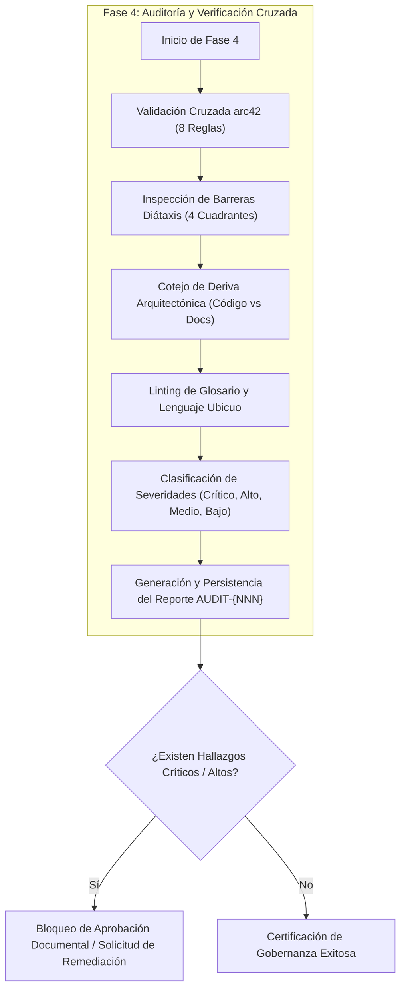
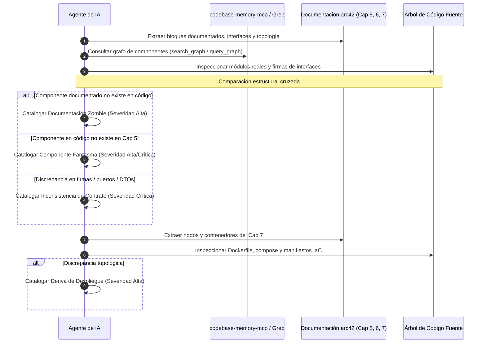
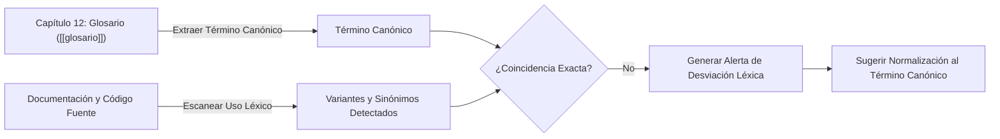

# Checklist de Auditoría Documental y Gobernanza (arc42 & Diátaxis)

Guía técnica de verificación algorítmica y control de calidad documental para el agente de IA. Define las reglas de consistencia cruzada, la preservación de barreras epistemológicas Diátaxis, la mitigación de deriva arquitectónica y el linting terminológico del lenguaje ubicuo.

---

## 1. Propósito

Este módulo de referencia formaliza las validaciones sistemáticas que el agente de IA **DEBE** ejecutar de manera obligatoria durante la **Fase 4 (Auditoría y Verificación Cruzada)** del ciclo de vida de gobernanza documental.

El propósito central de esta fase es certificar que la base de conocimiento técnico del proyecto actúe como una fuente viva y fidedigna de la verdad, garantizando:

1. **Integridad referencial interna**: Ningún capítulo de arc42 debe contradecir, omitir o desalinearse de los compromisos adquiridos en otros capítulos del estándar.
2. **Pureza epistemológica Diátaxis**: Los documentos deben respetar estrictamente los límites de su cuadrante asignado, evitando mezclas cognitivas perjudiciales para los consumidores de la documentación.
3. **Sincronización bidireccional (Código vs Documentación)**: Erradicación sistemática de componentes fantasma y documentación zombie mediante el cotejo contra el grafo de código real (`codebase-memory-mcp` o búsquedas de símbolos).
4. **Coherencia terminológica (Lenguaje Ubicuo)**: Apego absoluto a las definiciones del glosario formal ([[glosario]]), mitigando la ambigüedad conceptual.
5. **Persistencia y trazabilidad de hallazgos**: Registro inmutable de cada sesión de auditoría en el vault mediante notas formales en `docs/auditorias/AUDIT-{NNN}.md` creadas con herramientas MCP de Obsidian.



> [!IMPORTANT]
> El agente de IA no debe asumir que una documentación está al día por el simple hecho de que no existan errores de sintaxis Markdown. Toda validación de Fase 4 exige lectura activa y verificación de aserciones lógicas contra el código fuente y las notas del vault.

---

## 2. Validaciones de Consistencia entre Capítulos arc42

El agente de IA **DEBE** evaluar la matriz de consistencia estructural entre los 12 capítulos canónicos de arc42. La siguiente tabla especifica las 8 reglas de validación cruzada obligatorias, su condición de éxito y la severidad asignada a su incumplimiento:

| Regla ID | Capítulo Origen | Capítulo Destino | Expresión / Condición de Validación | Severidad |
| :--- | :--- | :--- | :--- | :--- |
| **V-ARC-01** | [[capitulo-05-vista-de-bloques]] | [[capitulo-03-contexto-y-alcance]] | Todo bloque de construcción de nivel 1 o 2 que interactúe con un actor externo o sistema tercero DEBE estar explícitamente listado en el diagrama de contexto y en la tabla de interfaces externas. | Crítico |
| **V-ARC-02** | [[capitulo-06-vista-de-ejecucion]] | [[capitulo-05-vista-de-bloques]] | Todo participante o línea de vida en diagramas de secuencia (`DS-CU-*`) DEBE corresponder a un bloque estructural previamente declarado en el catálogo de componentes. | Alto |
| **V-ARC-03** | [[capitulo-04-estrategia-solucion]] | [[capitulo-01-introduccion-y-metas]] | Toda decisión fundamental o patrón arquitectónico enunciado en la estrategia DEBE vincularse explícitamente mediante wikilink a al menos una meta de calidad declarada en la sección 1.2 (`[[capitulo-01-introduccion-y-metas#1.2 Metas de Calidad]]`). | Alto |
| **V-ARC-04** | [[capitulo-05-vista-de-bloques]] | [[capitulo-08-conceptos-transversales]] | Todo concepto transversal referenciado en la descripción de un bloque (autenticación, observabilidad, manejo de transacciones, caché) DEBE contar con una sección detallada y operativa en el capítulo 8. | Medio |
| **V-ARC-05** | [[capitulo-07-vista-de-despliegue]] | [[capitulo-05-vista-de-bloques]] | Todo artefacto, contenedor o proceso asignado a un nodo de infraestructura DEBE corresponder a un componente o bloque descrito en el capítulo 5. | Alto |
| **V-ARC-06** | [[capitulo-02-restricciones]] | [[capitulo-04-estrategia-solucion]] / [[capitulo-07-vista-de-despliegue]] | Toda restricción técnica, organizativa o legal del capítulo 2 DEBE ser explícitamente respetada por las decisiones de diseño del capítulo 4 y la topología del capítulo 7 sin contradicciones. | Crítico |
| **V-ARC-07** | Documentación General | [[glosario]] | Todo término técnico de dominio, acrónimo o entidad sustantiva utilizada en el texto arquitectónico DEBE tener una entrada canónica en el capítulo 12. | Medio |
| **V-ARC-08** | [[capitulo-09-decisiones]] | Registro de ADRs (`docs/adr/`) | Todo ADR referenciado DEBE existir como archivo independiente en `docs/adr/` y presentar un estado de ciclo de vida válido: `Propuesto`, `Aceptado`, `Obsoleto` o `Reemplazado`. | Alto |

### Directivas de Inspección para el Agente

#### V-ARC-01: Verificación de Frontera de Contexto
1. Extraer del capítulo 5 todos los bloques de construcción que posean dependencias salientes hacia APIs externas, bases de datos no gestionadas o pasarelas de pago.
2. Leer [[capitulo-03-contexto-y-alcance]].
3. Comprobar que cada sistema externo figure en la tabla de contexto técnico y de negocio. Si el bloque consume un servicio externo no listado en el contexto, registrar hallazgo Crítico.

#### V-ARC-02: Verificación de Participantes en Escenarios Runtime
1. Extraer los nombres de las entidades y líneas de vida de todos los diagramas de secuencia Mermaid en [[capitulo-06-vista-de-ejecucion]] y notas `diagramas-secuencia/DS-CU-*.md`.
2. Verificar la correspondencia exacta (1:1) contra la lista de bloques de [[capitulo-05-vista-de-bloques]].
3. Si un participante representa un controlador, servicio o worker que no figura en la vista de bloques, emitir hallazgo de severidad Alta.

#### V-ARC-03: Alineación de Estrategia con Metas de Calidad
1. Leer las decisiones clave descritas en [[capitulo-04-estrategia-solucion]].
2. Identificar la justificación de cada decisión: debe referenciar directamente los atributos de calidad (escalabilidad, latencia, disponibilidad, seguridad) definidos en [[capitulo-01-introduccion-y-metas#1.2 Metas de Calidad]].
3. Si una estrategia sustantiva carece de correlación con las metas de negocio o atributos de calidad, marcar como hallazgo de severidad Alta.

#### V-ARC-04: Cobertura de Conceptos Transversales
1. Localizar menciones a políticas transversales en el capítulo 5 (ejemplo: cifrado en reposo, auditoría de transacciones, rate-limiting, tracing distribuido).
2. Verificar la existencia de la subsección correspondiente dentro de [[capitulo-08-conceptos-transversales]].
3. Si el bloque asume un comportamiento transversal no normado en el capítulo 8, catalogar como severidad Media.

#### V-ARC-05: Paridad de Artefactos de Despliegue
1. Examinar los nodos y artefactos de despliegue del diagrama de topología en [[capitulo-07-vista-de-despliegue]].
2. Mapear cada unidad ejecutable (binario, contenedor Docker, worker, frontend SPA) con su definición de bloque en el capítulo 5.
3. Si un contenedor se encuentra en despliegue pero no existe como bloque arquitectónico, catalogar como componente no modelado (Alto).

#### V-ARC-06: Verificación de Cumplimiento de Restricciones
1. Compilar la lista de restricciones técnicas y regulatorias de [[capitulo-02-restricciones]] (ejemplo: PostgreSQL versión mínima 15, compatibilidad WCAG 2.1 AA, prohibición de cookies no esenciales sin consentimiento previo, hosting exclusivo en servidores soberanos).
2. Auditar las tecnologías elegidas en el capítulo 4 y los servicios de nube en el capítulo 7.
3. Cualquier desviación o incompatibilidad tecnológica respecto a las restricciones declaradas se considerará un hallazgo Crítico.

#### V-ARC-07: Exhaustividad del Glosario
1. Evaluar el texto arquitectónico identificando nombres de dominio, entidades de base de datos y conceptos técnicos de negocio.
2. Comprobar su inclusión en el archivo [[glosario]].
3. Si un término nuclear carece de definición, emitir hallazgo Medio.

#### V-ARC-08: Integridad y Estado de ADRs
1. Leer el inventario de decisiones arquitectónicas en [[capitulo-09-decisiones]].
2. Verificar contra los archivos físicos en `docs/adr/`.
3. Validar que el frontmatter YAML de cada ADR posea `estado: Propuesto | Aceptado | Obsoleto | Reemplazado`.
4. Si un ADR referenciado posee un estado inexistente (ejemplo: "En discusión", "Pendiente") o carece de archivo físico en el vault, emitir hallazgo Alto.

> [!WARNING]
> La omisión de relaciones causales entre la estrategia de solución ([[capitulo-04-estrategia-solucion]]) y las metas de calidad ([[capitulo-01-introduccion-y-metas]]) debilita la fundamentación del diseño del sistema. El agente debe exigir trazabilidad explícita mediante enlaces directos a las secciones correspondientes.

---

## 3. Verificación de Barreras Diátaxis

El framework Diátaxis divide la documentación técnica en cuatro cuadrantes ortogonales basados en dos ejes cardinales:
- **Eje horizontal (Intención)**: Orientado a la adquisición de habilidades prácticas vs orientado al conocimiento teórico/conceptual.
- **Eje vertical (Modo de uso)**: En servicio del trabajo/tarea inmediata vs en servicio del estudio/comprensión reflexiva.

```
                   PRÁCTICO (Acción)
                         ▲
                         │
        TUTORIALES       │     GUÍAS DE USO
      (Orientado al      │   (Orientado a tareas,
       aprendizaje)      │    usuario competente)
                         │
  ◄──────────────────────┼──────────────────────►
  ESTUDIO                │                 TRABAJO
                         │
       EXPLICACIÓN       │      REFERENCIA
      (Orientado a la    │   (Orientado a información,
       comprensión)      │     consulta técnica)
                         │
                         ▼
                   TEÓRICO (Conocimiento)
```

El agente de IA **DEBE** evaluar el contenido de cada documento según su cuadrante declarado o inferido, comprobando la ausencia estricta de transgresiones cruzadas mediante la siguiente lista de verificación:

### Reglas Negativas por Cuadrante

```
┌─────────────────────────────────────────────────────────────────────────────┐
│                    MATRIZ DE BARRERAS DIÁTAXIS                              │
├─────────────────┬───────────────────────────────────────────────────────────┤
│ Cuadrante       │ Prohibiciones Estrictas (El documento NO debe contener)   │
├─────────────────┼───────────────────────────────────────────────────────────┤
│ 1. Tutorial     │ - Tablas exhaustivas de referencia API o parámetros CLI.  │
│                 │ - Múltiples alternativas o bifurcaciones de decisión.     │
│                 │ - Disquisiciones teóricas abstractas o justificaciones.   │
├─────────────────┼───────────────────────────────────────────────────────────┤
│ 2. Guía de Uso  │ - Ejercicios formativos para principiantes.               │
│    (How-to)     │ - Explicaciones extensas sobre la teoría del sistema.     │
│                 │ - Catálogos completos de opciones de configuración.       │
├─────────────────┼───────────────────────────────────────────────────────────┤
│ 3. Referencia   │ - Narrativa pedagógica, opiniones personales o adjetivos. │
│                 │ - Instrucciones secuenciales paso a paso ("haga clic...").│
│                 │ - Justificaciones arquitectónicas históricas.             │
├─────────────────┼───────────────────────────────────────────────────────────┤
│ 4. Explicación  │ - Comandos de consola ejecutables o snippets instructivos.│
│                 │ - Guías secuenciales de resolución de problemas.          │
│                 │ - Tablas de parámetros crudos sin análisis conceptual.    │
└─────────────────┴───────────────────────────────────────────────────────────┘
```

### Heurísticas de Detección para el Agente

#### A. Tutoriales (`guia/tutoriales/`)
- **Objetivo**: Guiar al principiante hacia un logro visible y reproducible, construyendo confianza inicial.
- **Violación tipo 1: Inyección de Referencia**: Si el texto contiene tablas con más de 5 filas de parámetros de configuración o especificaciones completas de esquemas JSON, el agente debe exigir su extracción hacia un documento de referencia en `guia/referencia/`.
- **Violación tipo 2: Disyuntivas y Caminos Alternativos**: Frases como *"Puede utilizar Redis o bien Memcached"*, *"Si prefiere usar Docker, ejecute X; si prefiere binario local, ejecute Y"*. El tutorial debe mantener un único camino lineal y determinista.
- **Severidad de transgresión**: Medio.

#### B. Guías de Uso / How-To (`guia/casos-de-uso/`, `guia/tareas/`)
- **Objetivo**: Ayudar a un usuario competente a resolver una tarea específica o caso de uso real en su flujo de trabajo.
- **Violación tipo 1: Inclusión de Lecciones Básicas**: Si el documento gasta espacio explicando conceptos elementales como qué es HTTP o cómo instalar el entorno básico de desarrollo.
- **Violación tipo 2: Excursiones Teóricas**: Secciones extensas de análisis arquitectónico que no contribuyen directamente a la consecución del objetivo práctico. Deben refactorizarse con wikilinks hacia `arquitectura/`.
- **Severidad de transgresión**: Medio.

#### C. Referencia (`guia/referencia/`)
- **Objetivo**: Servir como catálogo fáctico, austero, exhaustivo e imparcial para la consulta inmediata de información técnica.
- **Violación tipo 1: Tono Narrativo o Juicios de Valor**: Oraciones con expresiones como *"Esta magnífica función permite agilizar el rendimiento"*, *"Recomendamos encarecidamente esta opción por ser más elegante"*. Debe sustituirse por lenguaje descriptivo objetivo y fáctico.
- **Violación tipo 2: Tutoriales Encubiertos**: Secciones con listas numeradas de pasos procedurales que enseñan a realizar una operación completa.
- **Severidad de transgresión**: Medio.

#### D. Explicación (`arquitectura/`, `guia/explicacion/`)
- **Objetivo**: Ofrecer comprensión profunda, perspectiva global, contexto histórico, trade-offs y fundamentos teóricos.
- **Violación tipo 1: Presencia de Pasos Instructivos**: Instrucciones del tipo *"Paso 1: Abra el archivo config.json; Paso 2: Pegue el siguiente bloque"*.
- **Violación tipo 2: Comandos de Ejecución**: Bloques de código bash con comandos operacionales para levantar servidores o migrar bases de datos. Deben ser reubicados a guías prácticas de despliegue o administración.
- **Severidad de transgresión**: Medio.

---

## 4. Detección de Deriva Arquitectónica (Código vs Documentación)

El agente de IA **DEBE** ejecutar el procedimiento automatizado de detección de desincronización entre la base documental y el código fuente del proyecto.



### Procedimiento Algorítmico Paso a Paso

#### Paso 1: Mapeo de Bloques de Construcción vs Módulos del Grafo
1. Parsear el archivo [[capitulo-05-vista-de-bloques]] y notas asociadas en `capitulo-05-vista-de-bloques/` para extraer el conjunto de entidades documentadas:
   $$\mathcal{B}_{\text{doc}} = \{b_1, b_2, \dots, b_n\}$$
2. Invocar la herramienta `search_graph` o `query_graph` del servidor `codebase-memory-mcp` para listar los módulos de negocio, servicios y controladores reconocidos en el repositorio:
   $$\mathcal{M}_{\text{code}} = \{m_1, m_2, \dots, m_k\}$$
3. Calcular la discrepancia simétrica de conjuntos para detectar divergencias estructurales.

#### Paso 2: Verificación de Contratos e Interfaces
1. Para cada bloque documentado con especificación de interfaces públicas, extraer:
   - Rutas de endpoints HTTP y verbos (ejemplo: `POST /api/v1/postulaciones`).
   - Esquemas de solicitud y respuesta (DTOs, esquemas Zod o clases de transferencia).
   - Nombres de métodos y tipos de parámetros en capas de servicio.
2. Localizar el archivo de código fuente correspondiente usando `grep_search` o `get_code_snippet`.
3. Comparar las firmas reales contra la documentación.
4. Si la documentación describe parámetros inexistentes en el código o ignora parámetros requeridos obligatorios, marcar como **Crítico**.

#### Paso 3: Detección de Componentes Fantasma (*Phantom Components*)
- **Definición**: Clases, servicios, microservicios, lambdas o controladores presentes en el código fuente que realizan tareas arquitectónicamente relevantes pero no se encuentran representados en el capítulo 5.
- **Acción del Agente**:
  - Filtrar componentes de infraestructura o utilitarios triviales.
  - Identificar servicios de dominio y módulos de negocio huérfanos de documentación:
    $$\mathcal{C}_{\text{fantasma}} = \mathcal{M}_{\text{code}} \setminus \mathcal{B}_{\text{doc}}$$
  - Clasificar cada elemento según su criticidad de negocio (Alto si expone endpoints o procesa transacciones nucleares; Medio si es un servicio de soporte interno).

#### Paso 4: Detección de Documentación Zombie (*Zombie Documentation*)
- **Definición**: Bloques, métodos, componentes o flujos descritos en arc42 que corresponden a funcionalidades retiradas, refactorizadas o renombradas en el código fuente.
- **Acción del Agente**:
  - Identificar elementos documentados que no cuentan con correspondencia en el AST ni en las búsquedas textuales del repositorio:
    $$\mathcal{D}_{\text{zombie}} = \mathcal{B}_{\text{doc}} \setminus \mathcal{M}_{\text{code}}$$
  - Toda documentación zombie genera confusión inmediata en los desarrolladores y riesgo operativo. Catalogar como hallazgo **Alto**.

#### Paso 5: Cotejo de la Topología de Despliegue vs Manifiestos IaC
1. Leer los nodos, puertos, volúmenes y variables de entorno documentados en [[capitulo-07-vista-de-despliegue]].
2. Inspeccionar los manifiestos de infraestructura en el repositorio:
   - Manifiestos Docker: `Dockerfile`, `docker-compose.yml`, `compose.yaml`.
   - Manifiestos Kubernetes / Helm: `k8s/*.yaml`, `charts/**/values.yaml`.
   - Infraestructura como Código: `terraform/*.tf`, scripts de aprovisionamiento.
3. Verificar paridad en:
   - Versiones de imágenes base (ejemplo: Node.js 20 vs 22; PostgreSQL 15 vs 16).
   - Puertos de exposición pública e interconexión interna de redes.
   - Mecanismos de persistencia y volúmenes montados.
4. En caso de discrepancias entre los puertos o topologías declaradas y los manifiestos reales, registrar hallazgo de severidad **Alta**.

---

## 5. Linting del Glosario y Lenguaje Ubicuo

El lenguaje ubicuo (Ubiquitous Language) es la base de la coherencia conceptual del software. Todo término técnico y entidad del dominio debe tener una denominación única y uniforme en la documentación, los diagramas y el código fuente.



### Procedimiento de Ejecución del Agente

#### Paso 1: Extracción del Léxico Canónico
1. Leer el archivo [[glosario]] (o capítulo 12 de arc42).
2. Estructurar el diccionario canónico del dominio conteniendo:
   - Término Canónico oficial.
   - Definición formal.
   - Sinónimos comunes expresamente prohibidos o alias secundarios permitidos.
   - Ámbito de aplicación (Frontend, Backend, Base de Datos, Modelo de Dominio).

#### Paso 2: Escaneo de Sinónimos y Variantes Léxicas en Documentación y Código
1. Ejecutar búsquedas con `grep_search` a través de los directorios `docs/`, `src/`, `features/`, `api/`.
2. Detectar el uso de términos divergentes para referirse a la misma entidad conceptual.

Ejemplo ilustrativo de tabla de equivalencias a monitorear:

| Término Canónico ([[glosario]]) | Variantes Prohibidas / No Canónicas | Contexto de Regla de Negocio | Severidad |
| :--- | :--- | :--- | :--- |
| **Usuario** | Cliente, Cuenta, Operador, Perfil | Sujeto principal autenticado en la plataforma. | Medio |
| **Organización** | Empresa, Entidad, Tenant, Compañía | Entidad jurídica asociada a suscripciones y contratos. | Medio |
| **Expediente Digital** | Legajo, Carpeta, Documentación, Paquete | Conjunto unificado de documentos adjuntos validados. | Medio |
| **Suscripción Activa** | Plan Vigente, Membresía, Contrato | Instrumento normativo para acceso a servicios del sistema. | Alto |
| **Evaluación** | Diagnóstico, Test, Examen, Medición | Instrumento aplicado para registrar métricas de desempeño. | Medio |

#### Paso 3: Emisión de Alertas y Acciones de Normalización
1. Si un documento utiliza un sinónimo en lugar del término canónico, el agente debe registrar la ubicación exacta (archivo y rango de líneas).
2. Proponer la sustitución directa por el término oficial para preservar la pureza del modelo semántico.
3. Si un concepto esencial no existe en el glosario pero se utiliza reiteradamente en el código, instruir la creación del término en [[glosario]].

---

## 6. Formato de Reporte de Auditoría

El agente de IA **DEBE** generar el reporte final utilizando estrictamente la siguiente plantilla estandarizada. 

> [!IMPORTANT]
> El reporte generado DEBE persistirse obligatoriamente en el vault de Obsidian mediante la herramienta `write_note` en la ruta:
> `docs/auditorias/AUDIT-{NNN}.md` (o `auditorias/AUDIT-{NNN}.md` de acuerdo a la estructura interna del vault).
> El identificador `{NNN}` debe ser secuencial de tres dígitos, calculado examinando las notas de auditoría preexistentes para asignar el entero consecutivo.

### Plantilla de Reporte Estandarizada

````markdown
---
id: AUDIT-{NNN}
titulo: "{titulo}"
tipo: auditoria
estado: completada
fecha: {fecha-ISO}
autor: agente-ia
modo: {incremental|completa}
commits_analizados: ["{hash1}", "{hash2}"]
tags: [auditoria, documentacion, arc42, diataxis]
---

# Resumen Ejecutivo

| Severidad | Cantidad |
|:---|:---|
| Critico | X |
| Alto | X |
| Medio | X |
| Bajo | X |

## Hallazgos por Dimensión

### Consistencia arc42

| # | Severidad | Elemento Doc | Elemento Código | Descripción | Acción Sugerida |
|:---|:---|:---|:---|:---|:---|

### Barreras Diátaxis

| # | Severidad | Documento | Cuadrante Esperado | Transgresión Detectada | Acción Sugerida |
|:---|:---|:---|:---|:---|:---|

### Deriva Arquitectónica

| # | Severidad | Componente | Estado | Descripción | Acción Sugerida |
|:---|:---|:---|:---|:---|:---|

### Glosario y Lenguaje Ubicuo

| # | Severidad | Término Canónico | Variante Encontrada | Ubicación | Acción Sugerida |
|:---|:---|:---|:---|:---|:---|

## Métricas Globales

- Cobertura arc42: X/12 capítulos con contenido
- Cobertura Diátaxis: X/4 cuadrantes con contenido
- ADRs registrados: X
- Última sincronización: {fecha}
- Componentes fantasma: X
- Documentación zombie: X
````

### Reglas de Llenado para el Agente

1. **id**: Formato `AUDIT-{NNN}` donde `{NNN}` es un correlativo entero de 3 dígitos con ceros a la izquierda (ejemplo: `AUDIT-025`).
2. **titulo**: Breve, conciso y en español técnico formal, describiendo el alcance de la inspección.
3. **fecha**: Fecha ISO 8601 estricta (`AAAA-MM-DD`).
4. **modo**: Declarar `incremental` si se evaluó un conjunto delimitado de commits o archivos modificados recientemente; `completa` si se auditó la totalidad de la documentación y el código base.
5. **commits_analizados**: Lista de hashes Git inspeccionados durante el ciclo de verificación.
6. **Tablas de Hallazgos**: Todas las columnas son de llenado obligatorio. Si una dimensión no arrojó desviaciones, escribir una fila indicando *"Sin hallazgos en esta dimensión"*.
7. **Acción Sugerida**: Debe ser una directiva técnica precisa y accionable (ejemplo: *"Actualizar firma del endpoint en [[capitulo-05-vista-de-bloques#5.2]] para incluir el campo `usuarioId: string`"*).

---

## 7. Severidades

El agente de IA **DEBE** categorizar cada hallazgo detectado aplicando la siguiente taxonomía y criterios objetivos:

| Nivel de Severidad | Criterio de Activación | Impacto en la Gobernanza Documental | Ejemplos Típicos |
| :--- | :--- | :--- | :--- |
| **Crítico** | La información documentada es **FALSA**, contradictoria o induce a fallos operativos directos al interactuar con el código. | **Bloqueo Inmediato**: Impide la aprobación del PR o la certificación del release. Exige corrección prioritaria antes de desplegar. | - API documentada con parámetros inexistentes o tipos incorrectos en el código.<br>- Contradicción directa de una restricción de seguridad o privacidad de datos del capítulo 2.<br>- Diagrama de contexto que omite una base de datos externa de terceros con datos sensibles. |
| **Alto** | Falta de documentación sobre un componente nuclear del sistema o persistencia de especificaciones sobre elementos eliminados. | **Acción Prioritaria**: Debe resolverse en el sprint en curso o en la siguiente iteración de documentación. | - Componente fantasma que orquesta procesos de negocio sin mención en el capítulo 5.<br>- Documentación zombie de microservicios o tablas SQL que ya no existen en el repositorio.<br>- Manifiesto IaC desplegando contenedores y puertos ausentes en la topología del capítulo 7. |
| **Medio** | Desviaciones de pureza metodológica o inconsistencias terminológicas que degradan la experiencia cognitiva del usuario. | **Remediación Programada**: Se subsana durante las tareas de mantenimiento y refactorización técnica regular. | - Violación de barreras Diátaxis (ejemplo: tutorial con explicaciones teóricas extensas o tablas de referencia saturadas).<br>- Uso reiterado de sinónimos informales en lugar de los términos canónicos del glosario.<br>- Concepto transversal referenciado en un bloque sin definición detallada en el capítulo 8. |
| **Bajo** | Errores menores de presentación, estilo, enlaces rotos no críticos, vacíos en ejemplos complementarios o formato imperfecto. | **Deuda Técnica Menor**: Subsanación oportuna sin impacto funcional directo. | - Sección o subcapítulo con encabezado válido pero texto incompleto o marcado como TODO.<br>- Ausencia de ejemplos de payload ilustrativos en llamadas exitosas de API.<br>- Formato de tabla o indentación de código Mermaid mejorable. |

> [!CAUTION]
> Calificar un hallazgo como **Bajo** cuando induce al desarrollador a errores de integración en código constituye una falla de auditoría. Si la discrepancia provoca que una llamada a una función o API falle en tiempo de ejecución, el agente DEBE categorizarla obligatoriamente como **Crítica**.
