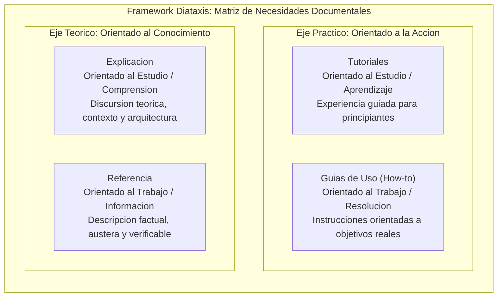
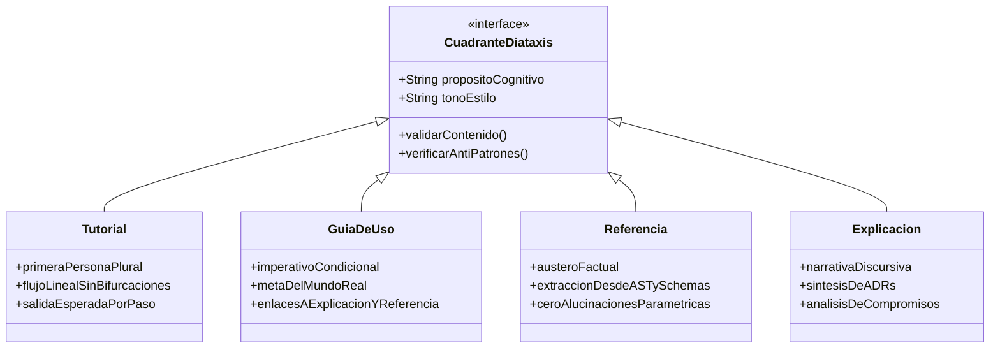
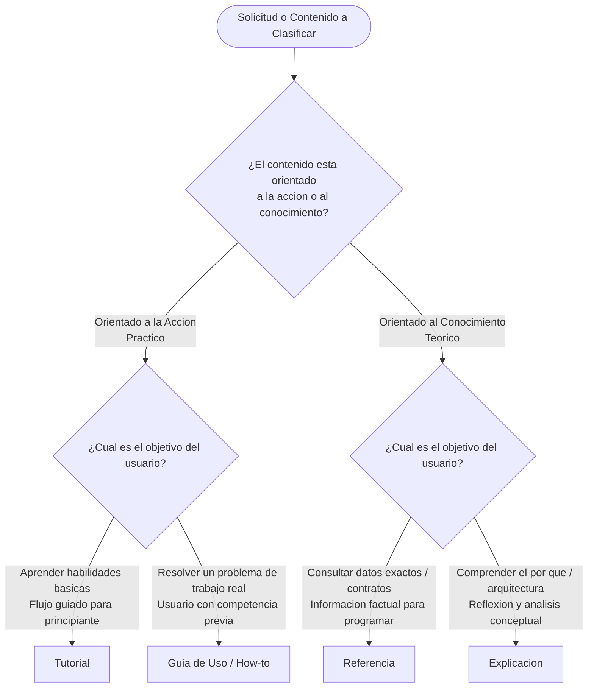
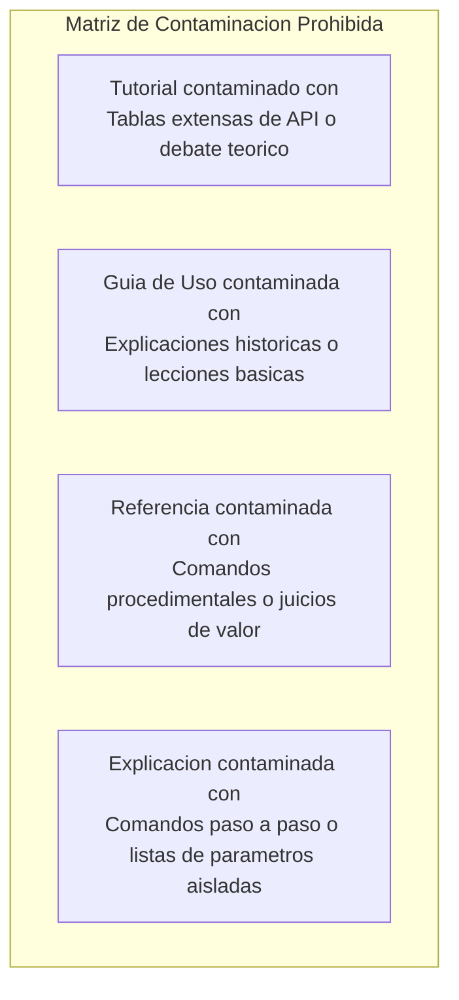
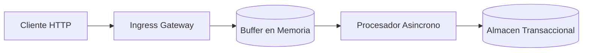

# Guia de Referencia: Cuadrantes del Framework Diataxis

Esta guia establece las directivas operativas para que el agente de IA clasifique, estructure, redacte y valide documentacion tecnica conforme al framework Diataxis. Cada seccion define reglas normativas que el agente debe ejecutar de manera determinista.

---

## 1. Modelo Conceptual

El framework Diataxis organiza la documentacion tecnica en cuatro cuadrantes ortogonales definidos por dos ejes fundamentales de necesidad del usuario:

1. **Eje Epistemico (Naturaleza del Conocimiento)**:
   - **Practico (Orientado a la accion)**: Centrado en lo que el usuario hace (procedimientos, ejecucion, manipulacion de artefactos).
   - **Teorico (Orientado al conocimiento)**: Centrado en lo que el usuario comprende o consulta (conceptos, arquitectura, especificaciones formales).

2. **Eje Teleologico (Modo de Interaccion / Contexto Mental)**:
   - **Estudio (Adquisicion de habilidades)**: El usuario se encuentra en una fase de aprendizaje; no requiere resolver un problema de produccion inmediato, sino internalizar conceptos o capacidades.
   - **Trabajo (Aplicacion profesional)**: El usuario tiene un objetivo laboral u operativo concreto que debe resolver con maxima eficiencia y minima friccion cognitiva.



### Matriz de Coordenadas

| Cuadrante | Eje Epistemico | Eje Teleologico | Enfoque Principal | Estado Mental del Usuario |
| :--- | :--- | :--- | :--- | :--- |
| **Tutoriales** | Practico | Estudio | Aprendizaje basico guiado | Principiante buscando adquirir competencia inicial. |
| **Guias de Uso** | Practico | Trabajo | Resolucion de tareas reales | Profesional competente buscando completar un objetivo. |
| **Referencia** | Teorico | Trabajo | Informacion tecnica factual | Desarrollador buscando datos exactos para trabajar. |
| **Explicacion** | Teorico | Estudio | Comprension y arquitectura | Ingeniero buscando entender el por que y el contexto. |

---

## 2. Tabla Maestra de Cuadrantes

El agente de IA debe aplicar las directivas especificas de cada cuadrante de forma estricta. Queda prohibido mezclar convenciones de estilo o intenciones cognitivas entre cuadrantes.



### 2.1. Tutoriales (Tutorials)

#### Proposito Cognitivo
Guiar al usuario en la adquisicion de competencias iniciales mediante una experiencia de aprendizaje estructurada, exitosa y reproducible. El usuario asume un rol de estudiante y delega el control de la sesion en el autor de la documentacion.

#### Reglas de Estilo y Redaccion
- **Voz y Tono**: Contrato profesor-alumno. Utilizar de forma obligatoria la primera persona del plural inclusiva (*"Crearemos un proyecto"*, *"Configuraremos la base de datos"*, *"Veamos el resultado"*).
- **Flujo**: Estrictamente lineal. Debe existir un unico camino desde el punto de inicio hasta el resultado final.
- **Predecibilidad**: Cada accion debe garantizar un resultado determinista e inmediato.
- **Restricciones de contenido**: PROHIBIDO introducir alternativas tecnicas (*"puede usar npm o yarn"*), bifurcaciones condicionales, digresiones teoricas o explicaciones profundas de diseño.

#### Directivas de Validacion para el Agente de IA
1. **Verificacion de Linealidad**: Inspeccionar que no existan oraciones disyuntivas (*"o bien"*, *"si prefiere"*, *"alternativamente"*). Si se detectan, el agente debe seleccionar la opcion por defecto y eliminar la bifurcacion.
2. **Entorno Encapsulado**: Garantizar que el tutorial defina claramente un entorno limpio y controlado (ej. directorio temporal, version de runtime fijada).
3. **Indicadores de Retroalimentacion**: Cada comando o accion de modificacion debe ir inmediatamente seguido de su salida esperada en terminal o interfaz:
   ```markdown
   Ejecutemos el siguiente comando para verificar el estado:

   npm test

   La salida esperada en la consola debe ser:

   PASS src/index.test.ts
   Tests: 1 passed, 1 total
   ```
4. **Conclusion Exitosa**: El tutorial debe culminar con un artefacto funcional visible que confirme el exito del aprendizaje.

#### Anti-patrones Prohibidos
- Introducir explicaciones arquitectonicas extensas antes de que el usuario ejecute codigo.
- Ofrecer opciones de eleccion de dependencias o configuraciones alternativas.
- Asumir herramientas no declaradas en la seccion inicial de prerrequisitos.
- Omitir la salida de confirmacion tras ejecutar un comando destructivo o de inicializacion.

> [!IMPORTANT]
> En un tutorial, el objetivo no es construir una aplicacion lista para produccion, sino proporcionar un camino exitoso garantizado en el menor tiempo cognitivo posible.

---

### 2.2. Guias de Uso (How-to Guides)

#### Proposito Cognitivo
Asistir a un usuario con competencia tecnica previa en la resolucion de un problema especifico o en la realizacion de una tarea concreta del mundo real. El usuario no busca aprender conceptos basicos; busca ejecutar una solucion eficazmente.

#### Reglas de Estilo y Redaccion
- **Voz y Tono**: Modo imperativo formal o condicional orientado a la tarea (*"Configure la variable X"*, *"Si requiere habilitar TLS, modifique el bloque Y"*).
- **Enfoque de Negocio / Operacion**: Orientado a metas reales del proyecto (ej. *"Como configurar replicacion multiregion en PostgreSQL"* en lugar de *"Aprendiendo bases de datos"*).
- **Economia Lingüistica**: Instrucciones concisas, directas y sin preambulos introductorios extensos.
- **Restricciones de contenido**: PROHIBIDO incluir ejercicios didacticos, explicaciones de conceptos elementales o evaluaciones formativas.

#### Directivas de Validacion para el Agente de IA
1. **Estructuracion Secuencial**: Organizar los pasos mediante listas ordenadas numeradas por dependencia logica estricta.
2. **Prerrequisitos Factuales**: Declarar al inicio unicamente el estado inicial requerido y dependencias instaladas.
3. **Manejo de Casos Extremos**: Incluir avisos sobre trampas comunes de operacion usando alertas de tipo `> [!WARNING]` o `> [!CAUTION]`.
4. **Desacoplamiento de Justificaciones**: No explicar el fundamento teorico dentro del paso de accion. El agente debe utilizar enlaces de tipo wikilink hacia el cuadrante de Explicacion (ej. `Para comprender la politica de reintentos, consulte [[explicacion/politica-resiliencia-red]].`).
5. **Desacoplamiento de Sintaxis**: Enlazar hacia el cuadrante de Referencia para detalles de campos y flags (ej. `Consulte [[referencia/cli/comandos-red]] para la descripcion de parametros.`).

#### Anti-patrones Prohibidos
- Explicar teoricamente el funcionamiento interno del componente antes de indicar la solucion operativa.
- Tratar al lector como un aprendiz novato explicando conceptos como que es una API o un contenedor.
- Diseñar guias abiertas sin un criterio claro de finalizacion de la tarea.

> [!WARNING]
> Nunca convierta una Guia de Uso en un tutorial. Si el usuario ya sabe que desea hacer (ej. *"Rotar certificados SSL en Kubernetes"*), el agente debe omitir introducciones sobre la historia de la criptografia.

---

### 2.3. Referencia (Reference)

#### Proposito Cognitivo
Proporcionar una descripcion factual, austera y exhaustiva de la maquinaria del software para consulta rapida durante la actividad de desarrollo u operacion.

#### Reglas de Estilo y Redaccion
- **Voz y Tono**: Descriptivo, neutro, formal, incondicional y estrictamente tecnico.
- **Estructura Espejo**: La jerarquia documental debe reflejar con precision matematica la estructura del codigo, la interfaz de linea de comandos (CLI), el esquema de base de datos o el contrato de la API.
- **Completitud y Precision**: Cada parametro, tipo de dato, valor por defecto y excepcion debe estar documentado sin omitir campos por brevedad.
- **Restricciones de contenido**: PROHIBIDO incluir opiniones, recomendaciones subjetivas, justificaciones de diseño o secuencias de pasos tutoriales.

#### Directivas de Validacion para el Agente de IA
1. **Tolerancia Cero a la Alucinacion**: El agente de IA tiene ESTRICTAMENTE PROHIBIDO inferir parametros, firmas de funciones, codigos de error HTTP o atributos de configuracion a partir de memoria probabilistica o conocimiento parametrico no verificado.
2. **Extraccion desde Fuente de Verdad (Ground Truth)**:
   - Extraer definiciones de especificaciones OpenAPI / Swagger formales.
   - Extraer esquemas desde JSON Schema, Protobuf o tipos del Abstract Syntax Tree (AST) del repositorio.
   - Utilizar herramientas de busqueda (`grep_search`, inspeccion de archivos) para corroborar nombres de variables y firmas exactas en el codigo fuente antes de redactar.
3. **Uniformidad Tabular**: Utilizar tablas GFM para documentar parametros, esquemas de solicitud/respuesta y variables de entorno.
4. **Ejemplos de Codigo Puros**: Los ejemplos deben limitarse a payloads validos, llamadas a metodos o invocaciones de comandos aisladas, sin narrativa procedimental circundante.

#### Anti-patrones Prohibidos
- Añadir juicios de valor (ej. *"Este parametro es muy util"* o *"Se recomienda no usar esto"* en lugar de *"Estado: Deprecated en version 2.1"*).
- Insertar flujos de trabajo completos de resolucion de problemas dentro de la documentacion de un endpoint.
- Inventar propiedades o tipos de retorno no declarados en el codigo fuente.

> [!CAUTION]
> Cualquier discrepancia entre la documentacion de Referencia y el codigo fuente real constituye un defecto critico de gobernanza documental. El agente debe validar la referencia contra el codigo fuente.

---

### 2.4. Explicacion (Explanation)

#### Proposito Cognitivo
Promover la comprension conceptual profunda, el juicio critico y la asimilacion de los principios de diseño, arquitectura y contexto historico del sistema. Permite al usuario comprender el *"por que"* de las decisiones de ingenieria.

#### Reglas de Estilo y Redaccion
- **Voz y Tono**: Reflexivo, academico, analitico y discursivo. Se escribe en tercera persona o estilo expositivo formal.
- **Espacio para Alternativas**: Es el UNICO cuadrante donde es legitimo y obligatorio contrastar alternativas, ponderar compensaciones (*trade-offs*) tecnicas y justificar por que no se implementaron otras vias.
- **Vision Holistica**: Conecta modulos, explica limites de contexto y aclara modelos de dominio.
- **Restricciones de contenido**: PROHIBIDO incluir secuencias de comandos de terminal, instrucciones operativas paso a paso o listados exhaustivos de parametros de API.

#### Directivas de Validacion para el Agente de IA
1. **Sintesis de Decisiones Arquitectonicas**: Integrar de forma coherente los registros de decisiones arquitectonicas existentes en el vault mediante wikilinks (ej. `[[adr/ADR-001-seleccion-motor-mensajeria]]`).
2. **Uso de Diagramas de Arquitectura**: Emplear diagramas Mermaid (C4, grafos de estado o secuencias logicas) para ilustrar flujos de informacion o topologias de software.
3. **Respuesta Sistematica al 'Por Que'**: Cada seccion debe responder explicitamente a la justificacion de diseño detras de una eleccion tecnologica o patron estructural.
4. **Perspectiva y Contexto**: Explicar restricciones tecnicas, dependencias externas, consideraciones de rendimiento y politicas de seguridad que influyeron en el diseño.

#### Anti-patrones Prohibidos
- Incluir un bloque de instalacion con `npm install` o comandos de despliegue.
- Redactar un catalogo de parametros de configuracion sin conexion conceptual con el modelo de dominio.
- Emitir opiniones dogmaticas sin fundamentacion basada en metricas, requerimientos no funcionales o trade-offs.

---

## 3. Heuristicas de Clasificacion para el Agente de IA

El agente de IA debe aplicar el siguiente algoritmo determinista para clasificar cualquier solicitud o contenido documental en el cuadrante Diataxis correspondiente:



### Tabla de Triggers Lingüisticos e Intenciones

| Patron de Entrada / Pregunta del Usuario | Intencion Cognitiva | Cuadrante Destino | Estructura de Salida Obligatoria |
| :--- | :--- | :--- | :--- |
| *"Como empiezo con..."*<br/>*"Primeros pasos con..."*<br/>*"Crear mi primer componente"* | Aprendizaje guiado paso a paso desde cero. | **Tutorial** | Flujo lineal, primera persona plural, comandos con salida esperada. |
| *"Como hago para rotar credenciales"*<br/>*"Pasos para exportar reportes a S3"*<br/>*"Como integrar X con Y"* | Resolucion de un problema de negocio u operacion. | **Guia de Uso** | Prerrequisitos factuales, pasos numerados en imperativo, notas de alerta. |
| *"Que parametros acepta la funcion X"*<br/>*"Cual es el payload del endpoint /v1/checkout"*<br/>*"Listado de codigos de error del microservicio"* | Consulta de especificaciones y contratos tecnicos. | **Referencia** | Tablas de firmas, tipos de datos, codigos de respuesta, cero narrativa discursiva. |
| *"Por que usamos WebSockets en lugar de SSE"*<br/>*"Cual es la arquitectura del pipeline de pagos"*<br/>*"Criterios de diseño para la particion de base de datos"* | Comprension de decisiones, trade-offs y fundamentos. | **Explicacion** | Ensayos tecnicos, diagramas C4/Mermaid, sintesis de trade-offs y enlaces a ADRs. |

### Reglas de Desambiguacion

En situaciones en las que una solicitud del usuario contenga intenciones mezcladas, el agente debe proceder conforme a las siguientes directivas:

1. **Ambigüedad entre Tutorial y Guia de Uso**:
   - Si la tarea es simple pero el usuario explicita que no conoce la tecnologia (*"Nunca he usado Docker, como lo configuro"*), clasificar como **Tutorial**.
   - Si la tarea involucra un escenario especifico de produccion o configuracion avanzada (*"Como configurar Docker con red overlay en swarm"*), clasificar como **Guia de Uso**.

2. **Ambigüedad entre Guia de Uso y Referencia**:
   - Si el usuario solicita un listado de opciones o variables, es **Referencia**.
   - Si el usuario solicita la secuencia de comandos para aplicar dichas opciones en una meta operativa, es **Guia de Uso**.

3. **Ambigüedad entre Explicacion y Referencia**:
   - Si se requiere saber la firma, tipo o formato del contrato, es **Referencia**.
   - Si se requiere saber por que el contrato tiene dicha forma o como interactua con el resto del sistema distribuido, es **Explicacion**.

---

## 4. Reglas de Barrera entre Cuadrantes (Quadrant Boundaries)

Para preservar la usabilidad y legibilidad de la documentacion, el agente de IA debe imponer barreras rigidas de separacion de contenidos.



### Matriz de Exclusiones Taxativas

```
+-------------------+-------------------------------------------------------------+
| Cuadrante         | Elementos ESTRICTAMENTE PROHIBIDOS en su interior           |
+-------------------+-------------------------------------------------------------+
| Tutorial          | - Tablas exhaustivas de referencia de parametros.          |
|                   | - Justificaciones filosoficas o analisis de alternativas.   |
|                   | - Instrucciones bifurcadas ('Opcion A' vs 'Opcion B').      |
+-------------------+-------------------------------------------------------------+
| Guia de Uso       | - Introducciones pedagogicas para principiantes.            |
|                   | - Explicacion del diseño interno del sistema.               |
|                   | - Catalogos exhaustivos de propiedades o atributos.         |
+-------------------+-------------------------------------------------------------+
| Referencia        | - Prosa narrativa o contextualizaciones historicas.         |
|                   | - Guias paso a paso de tareas de usuario.                   |
|                   | - Recomendaciones subjetivas ('deberia usar este campo').   |
+-------------------+-------------------------------------------------------------+
| Explicacion       | - Secuencias de comandos de consola para ejecutar tareas.   |
|                   | - Ejercicios guiados de aprendizaje.                        |
|                   | - Tablas de referencia desconectadas del marco conceptual.  |
+-------------------+-------------------------------------------------------------+
```

### Reglas de Enlace Inter-Cuadrante (Cross-linking)

Cuando el contenido requiera apoyo de otro cuadrante, el agente debe utilizar enlaces de Obsidian (`[[wikilinks]]`) respetando las siguientes convenciones de frontera:

- **Desde un Tutorial**:
  - Permitido: Enlace al final hacia Guias de Uso relacionadas: `Ahora que completamos el tutorial, revise [[guias/despliegue-produccion]]`.
  - Prohibido: Enlaces inline que interrumpan el flujo lineal de ejecucion.
- **Desde una Guia de Uso**:
  - Permitido: Enlaces a Referencia para firmas de comandos: `Para el catalogo completo de banderas, consulte [[referencia/cli-flags]]`.
  - Permitido: Enlace a Explicacion para profundizar en el motivo: `Para mas detalles sobre el modelo de consistencia, consulte [[explicacion/modelo-consistencia]]`.
- **Desde una Referencia**:
  - Permitido: Enlace a una Guia de Uso que ejemplifique el uso en produccion: `Ver aplicacion practica en [[guias/rotacion-llaves]]`.
  - Prohibido: Insertar texto explicativo dentro de la tabla de referencia.
- **Desde una Explicacion**:
  - Permitido: Enlaces a Referencia para inspeccionar contratos especificos y a ADRs del proyecto: `Consulte la especificacion en [[referencia/esquema-eventos]] y la decision formal en [[adr/ADR-004-bus-de-eventos]]`.

### Checklist de Linting Conceptual para el Agente

Antes de escribir o aprobar un artefacto documental, el agente de IA debe evaluar los siguientes puntos de control:

- [ ] ¿El documento pertenece inequívocamente a un unico cuadrante?
- [ ] ¿El tono del texto respeta la regla de voz de dicho cuadrante (plural inclusivo en tutorial, imperativo en guia, factual en referencia, expositivo en explicacion)?
- [ ] ¿Se eliminaron todas las bifurcaciones y alternativas en los tutoriales?
- [ ] ¿Se omitieron las introducciones historicas y teoricas en las guias de uso?
- [ ] ¿Se extrajeron todos los datos de la referencia desde schemas o codigo real sin alucinaciones?
- [ ] ¿Se canalizaron las justificaciones tecnicas hacia explicaciones o ADRs mediante wikilinks?

---

## 5. Plantillas Markdown Estandarizadas

El agente de IA debe utilizar estas plantillas maestras como esqueleto base para cada tipo de documento.

### 5.1. Plantilla de Tutorial

```markdown
# [Titulo del Tutorial: Orientado a la Accion y Aprendizaje]

<!-- 
DIRECTIVA IA: 
- Mantener tono en primera persona del plural (haremos, configuraremos).
- No incluir opciones alternativas ni bifurcaciones.
- Garantizar que cada comando tenga su bloque de salida esperada.
-->

En este tutorial crearemos [artefacto concreto y verificable] desde cero. Al finalizar, contaremos con [resultado tangible en funcionamiento].

## Prerrequisitos
Para completar este tutorial necesitamos:
- [Herramienta obligatoria en version fija, ej: Node.js 20 LTS]
- [Acceso o credencial basica en entorno de desarrollo local]

## Paso 1: Inicializacion del entorno
Comenzaremos creando el directorio de trabajo e inicializando el proyecto:

```bash
mkdir proyecto-ejemplo && cd proyecto-ejemplo
npm init -y
```

La salida esperada en la consola confirma la creacion del manifest:
```json
{
  "name": "proyecto-ejemplo",
  "version": "1.0.0"
}
```

## Paso 2: [Accion de construccion principal]
Escribiremos la configuracion minima en el archivo `config.json`:

```json
{
  "puerto": 8080,
  "entorno": "desarrollo"
}
```

## Paso 3: Verificacion del funcionamiento
Ejecutaremos el script de comprobacion:

```bash
node index.js
```

La salida esperada debe ser:
```text
Servicio iniciado exitosamente en puerto 8080.
```

## Resumen y Proximos Pasos
Hemos construido y verificado exitosamente [nombre del artefacto].
Para aprender a desplegar esta aplicacion en un cluster real, consulte la guia [[guias/despliegue-cluster]].
```

---

### 5.2. Plantilla de Guia de Uso (How-to Guide)

```markdown
# Como [Accion Concreta Orientada a Tarea de Produccion]

<!-- 
DIRECTIVA IA: 
- Redactar en modo imperativo o condicional formal.
- No incluir teoria sobre que es el sistema; asumir usuario competente.
- Cada paso debe ser conciso y enfocado a la resolucion directa.
- Enlazar explicaciones a cuadrante Explicacion y APIs a Referencia.
-->

Esta guia detalla el procedimiento para [resolver problema operativo concreto] en un entorno de [staging/produccion].

## Prerrequisitos
- Acceso con rol de administrador a [sistema objetivo].
- Variable de entorno `SERVICE_API_KEY` configurada con permisos de escritura.
- Para verificar los roles requeridos, consulte [[referencia/roles-permisos]].

## Procedimiento

### 1. Detencion controlada del servicio
Antes de modificar los parametros de red, detenga el proceso activo para evitar inconsistencias de conexion:

```bash
systemctl stop servicio-distribuido
```

> [!WARNING]
> Detener este servicio interrumpira el trafico entrante. Asegurese de que el balanceador ha drenado las conexiones activas.

### 2. Actualizacion de la configuracion
Modifique el archivo `/etc/servicio/config.yaml` ajustando los valores de sincronizacion:

```yaml
red:
  interfaz: "eth0"
  timeout_ms: 2500
  politica_reintentos: "exponencial"
```

> [!NOTE]
> Para comprender el modelo matematico de los reintentos, consulte [[explicacion/algoritmos-resiliencia-red]].

### 3. Validacion y reinicio
Ejecute la comprobacion de sintaxis y proceda con el inicio:

```bash
servicio-distribuido --verify-config && systemctl start servicio-distribuido
```

Verifique en los logs que el servicio reporta estado saludable (`health_status=OK`).

## Resolucion de Problemas Comunes
- **Error ECONNREFUSED**: Verifique la conectividad en el puerto configurado utilizando `nc -zv localhost 8080`.
- Para una lista completa de codigos de retorno, consulte [[referencia/codigos-error-cli]].
```

---

### 5.3. Plantilla de Referencia (Reference)

```markdown
# [Nombre del Modulo / Componente / API]: Referencia Tecnica

<!-- 
DIRECTIVA IA: 
- Lenguaje puramente factual, austero y descriptivo.
- PROHIBIDO inventar parametros; extraer directamente del AST o OpenAPI.
- No incluir pasos procedimentales ni justificaciones historicas.
-->

Documentacion tecnica formal y especificaciones del contrato para `[Modulo/Clase/Endpoint]`.

## Especificacion del Endpoint: `POST /api/v1/transacciones`

Registra una nueva transaccion financiera en el libro mayor.

### Encabezados Requeridos

| Encabezado | Tipo | Requerido | Descripcion |
| :--- | :--- | :--- | :--- |
| `Authorization` | String | Si | Token Bearer en formato JWT valido. |
| `X-Idempotency-Key` | UUIDv4 | Si | Llave unica para evitar cobros duplicados. |

### Parametros de Solicitud (Payload JSON)

| Campo | Tipo | Restricciones | Descripcion |
| :--- | :--- | :--- | :--- |
| `monto` | Integer | Min: 100, Max: 10000000 | Monto expresado en centavos de la moneda. |
| `moneda` | String | ISO-4217 (3 caracteres) | Codigo de divisa admitido (`USD`, `EUR`, `MXN`). |
| `cuenta_destino` | String | Regex: `^[A-Z0-9]{18}$` | Identificador CLABE o IBAN de la cuenta destino. |

#### Ejemplo de Solicitud Valida
```json
{
  "monto": 25000,
  "moneda": "MXN",
  "cuenta_destino": "123456789012345678"
}
```

### Respuestas HTTP

| Codigo HTTP | Estado | Descripcion |
| :--- | :--- | :--- |
| `201 Created` | Exitosa | Transaccion encolada para conciliacion inmediata. |
| `400 Bad Request` | Error de Cliente | El payload no cumple con las restricciones de validacion. |
| `409 Conflict` | Error de Idempotencia | La llave `X-Idempotency-Key` ya fue procesada con anterioridad. |

#### Ejemplo de Respuesta `201 Created`
```json
{
  "id_transaccion": "tx_99b7c84a_2026",
  "estado": "ENCOLADA",
  "fecha_creacion": "2026-09-14T12:00:00Z"
}
```
```

---

### 5.4. Plantilla de Explicacion (Explanation)

```markdown
# Arquitectura y Fundamentos de [Nombre del Dominio o Sistema]

<!-- 
DIRECTIVA IA: 
- Tono discursivo, reflexivo y academico.
- Explicar el "por que" de las decisiones tecnicas y el contexto.
- Comparar trade-offs y alternativas consideradas.
- Sintetizar ADRs del vault mediante wikilinks.
-->

Este documento analiza los principios de diseño, el modelo teorico y los compromisos arquitectonicos que gobiernan [Nombre del Sistema].

## Contexto y Motivacion
El sistema [Nombre del Sistema] fue concebido para resolver el problema de [describir problema de escala, concurrencia o consistencia]. En entornos con alta latencia de red, los modelos transaccionales sincronos tradicionales provocaban cuellos de botella severos.

## Topologia y Modelo Conceptual



El desacoplamiento entre la recepcion del evento y su procesamiento persistente permite absorber picos de trafico sin degradar el tiempo de respuesta del cliente.

## Analisis de Decisiones y Compromisos (Trade-offs)

### Procesamiento Asincrono vs. Procesamiento Transaccional Sincrono
Se evaluaron dos alternativas principales:

1. **Persistencia Sincrona Directa**:
   - *Ventaja*: Consistencia inmediata estricta (ACID).
   - *Desventaja*: Bloqueo de hilos de ejecucion ante picos de demanda y acoplamiento de latencia con la base de datos.
2. **Buffer Basado en Colas con Consistencia Eventual**:
   - *Ventaja*: Resiliencia ante fallos del almacenamiento y capacidad de absorcion de rafagas.
   - *Desventaja*: Se introduce una ventana de inconsistencia temporal de hasta 500 ms.

La decision formal de implementar el modelo asincrono se encuentra documentada en [[adr/ADR-003-consistencia-eventual-pagos]].

## Relacion con el Modelo de Dominio
El buffer en memoria opera bajo el patron de diseno *Command Query Responsibility Segregation* (CQRS). Para la consulta de firmas y eventos aceptados por este buffer, consulte [[referencia/esquema-eventos-buffer]]. Para procedimientos de ajuste de capacidad del buffer, revise la guia [[guias/escalado-buffers-memoria]].
```
