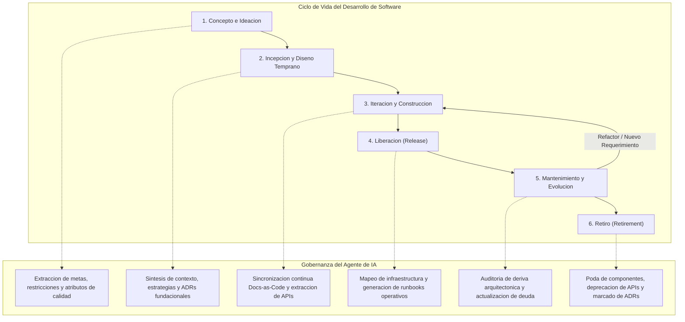

# Mapeo de SDLC con arc42 y Diátaxis

Este documento establece las directivas operativas que el agente de IA debe ejecutar para gobernar, generar y mantener la documentación técnica de un sistema durante todas las fases de su ciclo de vida de desarrollo de software (SDLC). Integra los 12 capítulos del estándar [[arc42-structure|arc42]] con los cuatro cuadrantes de la metodología [[diataxis-framework|Diátaxis]].

> [!IMPORTANT]
> Todas las directivas contenidas en este documento están formuladas como instrucciones algorítmicas directas para el agente de IA. El agente debe actuar de manera proactiva basándose en eventos del repositorio (triggers) y garantizar la trazabilidad bidireccional entre código, arquitectura y documentación.

---

## 1. Diagrama de flujo del ciclo de vida

El siguiente diagrama modela la progresión a través de las seis fases del SDLC y las transiciones gobernadas por el agente de IA:



---

## 2. Tabla maestra de mapeo SDLC

| Fase SDLC | Actividad Principal | Capítulos arc42 Activos | Cuadrantes Diátaxis Activos | Estrategia del Agente | Triggers de Activación |
| :--- | :--- | :--- | :--- | :--- | :--- |
| **Concepto e Ideación** | Formalización del problema, alcance preliminar y viabilidad. | Cap 1 (Introducción y Metas)<br>Cap 2 (Restricciones de la Arquitectura)<br>Cap 10 (Requerimientos de Calidad - Árbol preliminar) | **Explicación** (Conceptos fundacionales, visión del dominio, glosario) | **Rol: Analista de Requerimientos**<br>Ingestar tickets épicos, PRDs e historias de usuario iniciales. Sintetizar objetivos de negocio y forzar la explicitación de restricciones técnicas, legales y organizacionales. | Creación de repositorio, inicialización de proyecto, asignación de épica fundacional, kickoff. |
| **Incepción y Diseño Temprano** | Definición del diseño macro, selección de stack y delimitación de límites del sistema. | Cap 3 (Contexto y Alcance)<br>Cap 4 (Estrategia de Solución)<br>Cap 9 (Decisiones de Arquitectura - ADRs fundacionales) | **Explicación** (Justificación técnica del stack, trade-offs de arquitectura) | **Rol: Arquitecto de Sistemas**<br>Generar diagramas de contexto del sistema en formato Mermaid. Sintetizar decisiones clave en registros formales [[nygard-adr-specification\|ADR Nygard]]. Justificar elecciones técnicas frente a restricciones. | Definición de stack tecnológico, diseño de topología inicial, primer commit estructural/arquitectónico. |
| **Iteración y Construcción** | Desarrollo incremental de módulos, servicios, contratos de interfaz e infraestructura base. | Cap 5 (Vista de Bloques - Niveles 1 a 3)<br>Cap 6 (Vista de Tiempo de Ejecución)<br>Cap 8 (Conceptos Transversales) | **Referencia** (Especificación de APIs, esquemas de BD, CLI)<br>**Tutoriales** (Entornos locales de desarrollo, onboarding guiado) | **Rol: Ingeniero Docs-as-Code**<br>Ejecutar sincronización bidireccional continua. Extraer esquemas y firmas de métodos directamente del código fuente. Mantener diagramas de componentes C4 actualizados tras cada Pull Request. | Merge de Pull Request, creación de nuevos servicios/módulos, adición de endpoints o esquemas. |
| **Liberación (Release)** | Empaquetado, aprovisionamiento de infraestructura y despliegue a entornos objetivo. | Cap 7 (Vista de Despliegue) | **Guías de Uso** (Procedimientos de despliegue, configuración de variables, runbooks de rollback) | **Rol: Ingeniero de Plataforma/SRE**<br>Analizar manifiestos declarativos (Terraform, Helm, Kubernetes, Docker Compose). Derivar topología de red y mapeo de nodos. Generar guías operativas paso a paso con comandos validados. | Creación de Git tag/release, ejecución de pipeline de staging o producción, apertura de PR de infraestructura. |
| **Mantenimiento y Evolución** | Operación continua, monitoreo de incidentes, mitigación de riesgos y refactorización. | Cap 11 (Riesgos y Deuda Técnica)<br>Cap 10 (Actualización de Escenarios de Calidad) | **Referencia** (Actualización continua)<br>**Guías de Uso** (Resolución de incidencias, procedimientos forenses, playbooks) | **Rol: Auditor de Calidad y Confiabilidad**<br>Monitorear divergencias entre código base y diagramas estructurales ([[architectural-drift-detection\|Deriva Arquitectónica]]). Convertir post-mortems en guías operativas y documentar deuda técnica acumulada. | Cierre de incidentes de producción, cambios en dependencias (CVEs), refactorizaciones mayores, auditorías programadas. |
| **Retiro (Retirement)** | Desmantelamiento planificado de componentes, módulos, servicios o sistemas completos. | Cap 3 (Eliminación de actores y canales)<br>Cap 9 (Transición de ADRs a Obsoleto/Sustituido) | **Referencia** (Etiquetado de endpoints y contratos como deprecados con alternativas de migración) | **Rol: Coordinador de Transición y Decomiso**<br>Actualizar metadatos de estado en ADRs afectados. Eliminar nodos y aristas en diagramas de bloques y contexto. Preservar registros históricos y publicar guías de migración saliente. | Marcado de servicio como deprecado, inicio de migración de plataforma, fecha límite de sunset. |

---

## 3. Directivas de ejecución por fase

### 3.1 Fase 1: Concepto e Ideación

#### Directivas para el Agente
1. **Inspección de fuentes de entrada**:
   - Escanear archivos de requerimientos preliminares (`README.md`, issues fundacionales, documentos de requerimientos del producto o transcripciones de kickoff).
2. **Generación de arc42 Capítulo 1 (Introducción y Metas)**:
   - Extraer exactamente de 3 a 5 metas de negocio primarias en formato SMART.
   - Definir los stakeholders principales con sus roles, intereses y expectativas en una tabla formal.
3. **Generación de arc42 Capítulo 2 (Restricciones de la Arquitectura)**:
   - Clasificar restricciones en tres categorías obligatorias: técnicas (ej. versiones de runtime, latencia máxima), organizacionales (ej. equipo, presupuesto, calendarios) y regulatorias/legales (ej. GDPR, PCI-DSS).
4. **Generación de arc42 Capítulo 10 preliminar (Árbol de Calidad)**:
   - Mapear las metas a características ISO/IEC 25010 (Rendimiento, Seguridad, Mantenibilidad, Disponibilidad).
5. **Generación del cuadrante Diátaxis Explicación**:
   - Redactar documentos de visión y glosario del dominio, explicitando el modelo mental subyacente sin instrucciones imperativas.

> [!NOTE]
> En esta fase no deben redactarse manuales de instalación ni tutoriales detallados, dado que la arquitectura técnica no se encuentra fijada.

#### Ejemplo de directiva de transformación aplicada
```markdown
# Directiva de Agente: Formalizacion de Restricciones
Entrada: "El cliente requiere que la aplicacion sea rapida y funcione en la nube actual sin pagar licencias caras."
Salida generada en arc42 Cap 2:
| ID | Restriccion | Categoria | Justificacion / Impacto |
| :--- | :--- | :--- | :--- |
| RES-01 | Despliegue exclusivo en infraestructura AWS existente | Organizacional / Infraestructura | Evitar sobrecostos de aprovisionamiento multi-cloud. |
| RES-02 | Uso estricto de componentes de codigo abierto bajo licencias MIT/Apache 2.0 | Legal / Financiera | Restriccion presupuestaria de licenciamiento comercial. |
| RES-03 | Tiempo de respuesta P95 < 200 ms para endpoints de consulta | Tecnica | Meta de usabilidad no funcional vinculada al SLA del negocio. |
```

---

### 3.2 Fase 2: Incepción y Diseño Temprano

#### Directivas para el Agente
1. **Generación de arc42 Capítulo 3 (Contexto y Alcance)**:
   - Construir dos diagramas delimitados:
     - **Contexto de Negocio**: Actores humanos y sistemas externos de alto nivel.
     - **Contexto Técnico**: Protocolos de transporte (HTTP/REST, gRPC, AMQP), formatos de intercambio (JSON, Protobuf) y fronteras de red.
2. **Generación de arc42 Capítulo 4 (Estrategia de Solución)**:
   - Resumir las decisiones de diseño fundamentales (ej. arquitectura hexagonal, event-driven architecture, monorrepósito modular).
3. **Formalización de arc42 Capítulo 9 (Decisiones de Arquitectura - ADRs)**:
   - Por cada elección de tecnología, framework o patrón estructural, generar un archivo [[nygard-adr-specification|ADR Nygard]] estructurado: `Title`, `Status`, `Context`, `Decision`, `Consequences`.
4. **Generación de Diátaxis Explicación**:
   - Articular la justificación comparativa de las tecnologías elegidas (evaluación de trade-offs frente a opciones descartadas).

#### Ejemplo de plantilla Mermaid para Contexto Técnico (Cap 3)
```mermaid
graph TB
    subgraph Boundary ["Frontera del Sistema: Nucleo Transaccional"]
        System["Servicio Core\n[Go / Echo]"]
    end

    User["Cliente Web\n[React]"] -->|"HTTPS / JSON"| System
    Partner["Pasarela de Pagos Externa"] <--|"mTLS / REST"| System
    DB[("Base de Datos Relacional\n[PostgreSQL 16]")] <--|"TCP / SQL"| System
    Cache[("Cache Distribuida\n[Redis 7]")] <--|"TCP / RESP"| System
```

---

### 3.3 Fase 3: Iteración y Construcción

#### Directivas para el Agente
1. **Sincronización continua de arc42 Capítulo 5 (Vista de Bloques)**:
   - **Nivel 1**: Descomposición del sistema en subsistemas o servicios ejecutables.
   - **Nivel 2**: Descomposición interna de cada subsistema en módulos, paquetes o adaptadores hexagonales.
   - **Nivel 3**: Inspección estática del código base para mapear clases y estructuras críticas solo cuando aporten alto valor explicativo.
2. **Construcción de arc42 Capítulo 6 (Vista de Tiempo de Ejecución)**:
   - Generar diagramas de secuencia Mermaid para los flujos más críticos (ej. ciclo de autenticación, procesamiento asíncrono de eventos, manejo de transacciones distribuidas).
3. **Consolidación de arc42 Capítulo 8 (Conceptos Transversales)**:
   - Documentar patrones repetitivos implementados en el código: manejo global de excepciones, auditoría y logging estructurado, estrategia de hashing de contraseñas, serialización temporal UTC.
4. **Generación de Diátaxis Referencia**:
   - Sintetizar automáticamente las definiciones de interfaces a partir de código (OpenAPI 3.1 para endpoints REST, GraphQL Schemas, archivos `.proto`, esquemas relacionales DDL o esquemas ORM Prisma/TypeORM).
5. **Generación de Diátaxis Tutoriales**:
   - Redactar guías de orientación al principiante para arrancar el entorno de desarrollo local paso a paso desde cero.

> [!IMPORTANT]
> El agente no debe inventar firmas de métodos ni esquemas. Toda especificación en el cuadrante de Referencia debe ser extraída directamente de los archivos fuente validados del repositorio.

---

### 3.4 Fase 4: Liberación (Release)

#### Directivas para el Agente
1. **Extracción y generación de arc42 Capítulo 7 (Vista de Despliegue)**:
   - Analizar los archivos de orquestación e infraestructura como código:
     - Archivos `docker-compose.yml`, Helm Charts, manifiestos K8s (`Deployment`, `Service`, `Ingress`, `ConfigMap`), plantillas Terraform o CloudFormation.
   - Mapear cada elemento de software (bloque de Cap 5) a su nodo de ejecución físico o virtual (contenedor, pod, instancia EC2, bucket S3).
   - Indicar canales de comunicación, variables de entorno requeridas y volúmenes de persistencia montados.
2. **Generación del cuadrante Diátaxis Guías de Uso (How-To Guides)**:
   - Procedimiento de despliegue paso a paso para el operador.
   - Guía de configuración y rotación de credenciales / secretos.
   - Manual de diagnóstico de fallas comunes y runbook de rollback de emergencia.

#### Ejemplo de directiva para Guía de Despliegue (Diátaxis How-To)
```markdown
# Directiva de Agente: Estilo de Redaccion para Guias de Despliegue
- Titulo: Debe iniciar con un verbo de accion orientado a la meta del operador (ej. "Como desplegar el servicio de pagos en staging").
- Enfoque: Resolver un problema concreto paso a paso.
- Formato de comandos: Bloques bash ejecutables con flags explicados.
- Sin teoria abstracta: La justificacion conceptual pertenece a Explicacion, no a la Guia de Uso.
```

---

### 3.5 Fase 5: Mantenimiento y Evolución

#### Directivas para el Agente
1. **Gestión de arc42 Capítulo 11 (Riesgos y Deuda Técnica)**:
   - Mantener un registro activo de vulnerabilidades detectadas en dependencias, cuellos de botella de escalabilidad identificados y desviaciones respecto a los estándares de arquitectura acordados.
   - Clasificar cada riesgo según su probabilidad (Baja, Media, Alta) e impacto (Bajo, Medio, Alto).
2. **Monitoreo de [[architectural-drift-detection|Deriva Arquitectónica]]**:
   - Comparar periódicamente las dependencias importadas en el código fuente contra las relaciones permitidas en los diagramas de bloques (Cap 5).
   - Disparar una alerta documental si se detectan dependencias circulares no autorizadas o componentes no catalogados.
3. **Actualización de Diátaxis Guías de Uso**:
   - Incorporar runbooks de resolución rápida basados en incidentes reales (post-mortem synthesis).
4. **Refinamiento de arc42 Capítulo 10**:
   - Cuantificar el cumplimiento de los escenarios de calidad con base en métricas reales de telemetría (latencia P95/P99 observada, tasa de disponibilidad mensual).

> [!WARNING]
> La falta de actualización de los diagramas ante cambios estructurales en el código provoca obsolescencia crítica. El agente debe bloquear la aprobación documental si detecta deriva no sincronizada.

---

### 3.6 Fase 6: Retiro (Retirement)

#### Directivas para el Agente
1. **Actualización de arc42 Capítulo 9 (ADRs)**:
   - Localizar todos los ADRs vinculados a las tecnologías o componentes retirados.
   - Cambiar su estado a `Deprecated`, `Superseded` (indicando el nuevo ADR mediante wikilink) o `Obsolete`.
2. **Poda de arc42 Capítulo 3 (Contexto) y Capítulo 5 (Bloques)**:
   - Eliminar actores, dependencias externas y componentes decomisados de los diagramas Mermaid.
   - Dejar una anotación textual de trazabilidad histórica en la sección de evolución del capítulo.
3. **Deprecación en Diátaxis Referencia**:
   - Añadir encabezados de deprecación explícitos a las especificaciones de API, esquemas y endpoints afectados, especificando fecha límite de sunset y endpoints de sustitución.
4. **Publicación de Guía de Migración (Diátaxis Guías de Uso)**:
   - Detallar los pasos necesarios para que clientes o servicios consumidores migren sus integraciones hacia los nuevos módulos o alternativas vigentes.

---

## 4. Artefactos esperados por fase

La siguiente tabla enumera los artefactos documentales concretos que el agente de IA debe verificar y asegurar al completar cada fase del SDLC:

| Fase SDLC | Ruta Estándar del Artefacto | Descripción del Contenido | Estado Requerido | Documento Relacionado |
| :--- | :--- | :--- | :--- | :--- |
| **Concepto e Ideación** | `docs/arc42/01-introduction-and-goals.md` | Metas SMART del negocio, lista formal de stakeholders y prioridades. | Validado | [[arc42-structure#cap-1\|Metas y Stakeholders]] |
| **Concepto e Ideación** | `docs/arc42/02-architecture-constraints.md` | Restricciones clasificadas (técnicas, organizacionales, normativas). | Aprobado | [[arc42-structure#cap-2\|Restricciones]] |
| **Concepto e Ideación** | `docs/diataxis/explanation/domain-vision.md` | Conceptos de negocio, modelo mental del dominio y terminología. | Preliminar | [[diataxis-framework#explicacion\|Visión del Dominio]] |
| **Incepción y Diseño** | `docs/arc42/03-context-and-scope.md` | Diagramas de contexto de negocio y técnico en Mermaid con delimitaciones de frontera. | Aprobado | [[arc42-structure#cap-3\|Contexto]] |
| **Incepción y Diseño** | `docs/arc42/04-solution-strategy.md` | Decisiones clave de alto nivel, patrones arquitectónicos y selección de stack. | Aprobado | [[arc42-structure#cap-4\|Estrategia]] |
| **Incepción y Diseño** | `docs/adr/ADR-0001-*.md` a `ADR-000N-*.md` | Decisiones fundacionales individuales en formato Nygard estandarizado. | Aceptado | [[nygard-adr-specification\|ADRs Fundacionales]] |
| **Incepción y Diseño** | `docs/diataxis/explanation/tech-stack-rationale.md` | Justificación técnica y trade-offs entre tecnologías evaluadas. | Activo | [[diataxis-framework#explicacion\|Justificación Tecnológica]] |
| **Iteración y Construcción** | `docs/arc42/05-building-block-view.md` | Jerarquía C4 de componentes (Nivel 1 a 3) sincronizada con el código fuente. | Sincronizado | [[arc42-structure#cap-5\|Vista de Bloques]] |
| **Iteración y Construcción** | `docs/arc42/06-runtime-view.md` | Diagramas de secuencia y estados para flujos de ejecución primarios y críticos. | Actualizado | [[arc42-structure#cap-6\|Tiempo de Ejecución]] |
| **Iteración y Construcción** | `docs/arc42/08-crosscutting-concepts.md` | Estándares de seguridad, persistencia, telemetría, errores y transaccionalidad. | Activo | [[arc42-structure#cap-8\|Conceptos Transversales]] |
| **Iteración y Construcción** | `docs/diataxis/reference/api-specification.md` | Especificación OpenAPI / GraphQL extraída directamente de código fuente. | Factual / Código | [[diataxis-framework#referencia\|Referencia API]] |
| **Iteración y Construcción** | `docs/diataxis/tutorials/dev-environment-setup.md` | Guía de onboarding para configurar y levantar el entorno local paso a paso. | Probado | [[diataxis-framework#tutoriales\|Tutorial Setup]] |
| **Liberación (Release)** | `docs/arc42/07-deployment-view.md` | Mapeo de topología de infraestructura, nodos de cómputo, redes y volúmenes. | Congelado por Release | [[arc42-structure#cap-7\|Vista de Despliegue]] |
| **Liberación (Release)** | `docs/diataxis/how-to/deploy-guide.md` | Procedimiento paso a paso para desplegar artefactos en entornos de staging y producción. | Validado | [[diataxis-framework#guias-de-uso\|Guía de Despliegue]] |
| **Liberación (Release)** | `docs/diataxis/how-to/rollback-runbook.md` | Procedimiento de mitigación rápida y retorno a versión estable ante fallos en release. | Probado | [[diataxis-framework#guias-de-uso\|Runbook Rollback]] |
| **Mantenimiento y Evolución**| `docs/arc42/10-quality-requirements.md` | Escenarios de calidad con métricas observadas en producción y resultados de pruebas. | Dinámico | [[arc42-structure#cap-10\|Requerimientos Calidad]] |
| **Mantenimiento y Evolución**| `docs/arc42/11-risks-and-technical-debt.md` | Matriz de riesgos actualizada, vulnerabilidades pendientes y registro de deuda técnica. | Activo | [[arc42-structure#cap-11\|Riesgos y Deuda]] |
| **Mantenimiento y Evolución**| `docs/diataxis/how-to/incident-resolution-*.md` | Playbooks de mitigación de incidentes operacionales específicos derivados de post-mortems. | Auditado | [[diataxis-framework#guias-de-uso\|Playbooks Incidencias]] |
| **Retiro (Retirement)** | `docs/adr/ADR-*-deprecated.md` | ADRs correspondientes con metadatos actualizados a estado Obsoleto o Sustituido. | Obsoleto | [[nygard-adr-specification\|ADRs Retirados]] |
| **Retiro (Retirement)** | `docs/diataxis/how-to/migration-guide-*.md` | Guía detallada de desincorporación, exportación de datos y migración alternativa. | Congelado | [[diataxis-framework#guias-de-uso\|Guía de Migración]] |

---

## 5. Métricas de completitud documental

El agente de IA debe evaluar y reportar estas métricas cuantificables de forma continua para certificar la salud documental del repositorio.

### 5.1 Fórmulas de cálculo

#### 1. Cobertura de Capítulos arc42
$$\text{Cobertura arc42 (\%)} = \left( \frac{\sum_{i=1}^{12} \text{CapituloActivo}(i) \times \text{TieneContenidoValido}(i)}{\text{CapitulosExigidosPorFase}} \right) \times 100$$

- Un capítulo se considera con *Contenido Válido* si no contiene marcadores de posición (`TODO`, `TBD`, texto de plantilla sin editar) y cuenta con al menos un diagrama o tabla formal según corresponda.

#### 2. Cobertura de Cuadrantes Diátaxis
$$\text{Cobertura Diátaxis (\%)} = \left( \frac{\text{CuadrantesConDocumentosValidados}}{\text{CuadrantesRequeridosPorFase}} \right) \times 100$$

#### 3. Ratio de Registro de Decisiones de Arquitectura (ADR Ratio)
$$\text{Ratio ADR} = \frac{\text{Numero de ADRs en Estado Aceptado / Reemplazado / Obsoleto}}{\text{Numero de Decisiones Tecnicas Estructurales Identificadas}}$$

- El valor objetivo debe ser siempre $1.0$. Todo cambio mayor de biblioteca, base de datos, protocolo o división modular debe poseer un ADR asociado.

#### 4. Brecha Temporal de Sincronización (Sync Lag)
$$\Delta T_{\text{sync}} = \text{Timestamp}_{\text{Ultimo Commit de Codigo Relevante}} - \text{Timestamp}_{\text{Ultimo Commit de Documentacion}}$$

- Umbral de alerta: $\Delta T_{\text{sync}} > 0$ tras el merge de un Pull Request con etiquetas `architecture`, `api-breaking` o `core-refactor`.

---

### 5.2 Checklist de validación por fase

El agente de IA debe ejecutar las siguientes comprobaciones booleanas antes de certificar la finalización de una fase:

#### Checklist: Concepto e Ideación
- [ ] Cap 1: Se definieron formalmente de 3 a 5 metas de negocio primarias.
- [ ] Cap 1: La tabla de stakeholders contiene al menos 3 roles diferenciados con expectativas documentadas.
- [ ] Cap 2: Existen al menos 3 restricciones clasificadas en técnicas, organizacionales y regulatorias.
- [ ] Cap 10: Se identificaron los atributos de calidad clave en el árbol de calidad preliminar.
- [ ] Diátaxis Explicación: Se documentó la visión general del sistema y el glosario terminológico.
- [ ] Métrica: Cobertura arc42 de la fase >= 100%.

#### Checklist: Incepción y Diseño Temprano
- [ ] Cap 3: Diagrama de contexto de negocio presente en formato Mermaid.
- [ ] Cap 3: Diagrama de contexto técnico presente con interfaces y protocolos explícitos.
- [ ] Cap 4: Estrategia de solución documentada y alineada con las restricciones de Cap 2.
- [ ] Cap 9: Todos los componentes clave del stack tecnológico cuentan con un archivo ADR Nygard en `docs/adr/`.
- [ ] Diátaxis Explicación: Redactada la comparativa de tecnologías evaluadas y justificadas.
- [ ] Métrica: Ratio ADR = 1.0.

#### Checklist: Iteración y Construcción
- [ ] Cap 5: Vista de bloques Nivel 1 y Nivel 2 actualizada con los módulos actuales del código.
- [ ] Cap 6: Al menos 2 diagramas de secuencia modelando los flujos de mayor impacto.
- [ ] Cap 8: Documentadas las políticas transversales (autenticación, errores, logging).
- [ ] Diátaxis Referencia: Esquemas de API y contratos de datos actualizados sin inconsistencias contra código.
- [ ] Diátaxis Tutoriales: Tutorial de puesta en marcha del entorno local validado funcionalmente.
- [ ] Métrica: Delta T sync = 0 (sincronización realizada en el mismo PR o pipeline).

#### Checklist: Liberación (Release)
- [ ] Cap 7: Vista de despliegue mapeada integralmente desde los manifiestos de infraestructura (K8s/Terraform).
- [ ] Cap 7: Variables de entorno, puertos y puntos de montaje de volúmenes explicitados.
- [ ] Diátaxis Guías de Uso: Guía de despliegue paso a paso redactada y validada en entorno de staging.
- [ ] Diátaxis Guías de Uso: Runbook de rollback disponible con comandos ejecutables directos.
- [ ] Métrica: Cobertura Diátaxis Guías de Uso = 100% sobre la matriz de despliegue.

#### Checklist: Mantenimiento y Evolución
- [ ] Cap 10: Escenarios de calidad contrastados contra datos reales de monitoreo / telemetría.
- [ ] Cap 11: Matriz de riesgos actualizada con evaluación de severidad y planes de mitigación.
- [ ] Cap 11: Registro de deuda técnica categorizado con estimación de impacto.
- [ ] Auditoría: Verificación de deriva arquitectónica sin violaciones estructurales abiertas.
- [ ] Diátaxis Guías de Uso: Runbooks de incidentes enriquecidos con post-mortems recientes.

#### Checklist: Retiro (Retirement)
- [ ] Cap 3 y Cap 5: Diagramas de contexto y bloques actualizados sin referencias a componentes eliminados.
- [ ] Cap 9: ADRs correspondientes marcados formalmente como Deprecated u Obsolete.
- [ ] Diátaxis Referencia: Endpoints retirados etiquetados con advertencia visible de deprecación.
- [ ] Diátaxis Guías de Uso: Publicada guía de migración saliente o exportación de datos para usuarios.
- [ ] Integridad: No existen enlaces rotos o referencias huérfanas hacia artefactos purgados.

---

> [!TIP]
> Para mantener la máxima salud documental en repositorios automatizados, el agente de IA debe programar un trabajo periódico de verificación de enlaces, esquemas desactualizados y discrepancias sintácticas en los bloques Mermaid.
