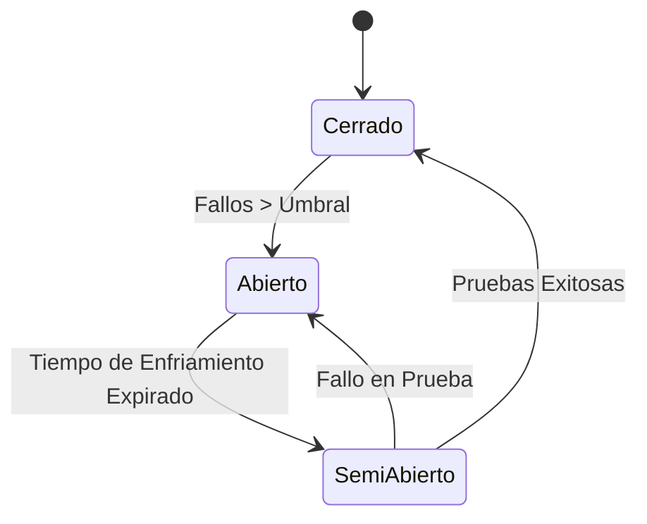

# Resiliencia de Red: Jitter, Circuit Breakers, Bulkheads e Idempotencia

La mitigación de sobrecarga en sistemas distribuidos evita que fallos locales transitorios desencadenen tormentas de reintento (*Retry Storms*) y colapsos en cascada.

---

## 1. Algoritmos de Retraso Exponencial con Fluctuación (Jitter)

Sea $B$ el retraso base (ej. 100 ms), $M$ el retraso máximo (ej. 10000 ms), y $i$ el número secuencial de intento ($0, 1, 2, \dots$).

### A. Full Jitter (Recomendado por defecto)
Distribuye uniformemente los reintentos entre cero y el límite exponencial superior, eliminando los picos de tráfico concurrente.

$$\text{Límite} = \min(M, B \times 2^i)$$
$$\text{Sleep} = \text{random}(0, \text{Límite})$$

```typescript
export function calcularFullJitter(intento: number, baseMs = 100, maxMs = 10000): number {
  const limite = Math.min(maxMs, baseMs * Math.pow(2, intento));
  return Math.floor(Math.random() * limite);
}
```

### B. Equal Jitter
Garantiza una pausa mínima fija (la mitad del tiempo exponencial) y aleatoriza la otra mitad.

$$\text{Temp} = \min(M, B \times 2^i)$$
$$\text{Sleep} = \frac{\text{Temp}}{2} + \text{random}\left(0, \frac{\text{Temp}}{2}\right)$$

```typescript
export function calcularEqualJitter(intento: number, baseMs = 100, maxMs = 10000): number {
  const temp = Math.min(maxMs, baseMs * Math.pow(2, intento));
  const mitad = temp / 2;
  return Math.floor(mitad + Math.random() * mitad);
}
```

### C. Decorrelated Jitter
Calcula el tiempo de retraso basándose en el retraso del intento previo, aumentando la dispersión temporal sin depender rígidamente del índice.

$$\text{Sleep}_{i} = \min(M, \text{random}(B, \text{Sleep}_{i-1} \times 3))$$

```typescript
export function calcularDecorrelatedJitter(sleepPrevio: number, baseMs = 100, maxMs = 10000): number {
  const nuevoSleep = baseMs + Math.random() * (sleepPrevio * 3 - baseMs);
  return Math.floor(Math.min(maxMs, Math.max(baseMs, nuevoSleep)));
}
```

---

## 2. Patrón Cortocircuito (Circuit Breaker)

Protege al sistema evitando llamadas a dependencias caídas que agoten hilos asíncronos y conexiones.



```typescript
export enum EstadoCircuito {
  CERRADO = "CERRADO",
  ABIERTO = "ABIERTO",
  SEMI_ABIERTO = "SEMI_ABIERTO",
}

export class CircuitBreaker {
  private estado: EstadoCircuito = EstadoCircuito.CERRADO;
  private fallosConsecutivos = 0;
  private ultimoFallo = 0;

  constructor(
    private readonly umbralFallos = 5,
    private readonly tiempoEnfriamientoMs = 30000
  ) {}

  async ejecutar<T>(operacion: () => Promise<T>): Promise<T> {
    const ahora = Date.now();

    if (this.estado === EstadoCircuito.ABIERTO) {
      if (ahora - this.ultimoFallo > this.tiempoEnfriamientoMs) {
        this.estado = EstadoCircuito.SEMI_ABIERTO;
      } else {
        throw new Error("CIRCUIT_BREAKER_OPEN: El servicio downstream esta temporalmente no disponible.");
      }
    }

    try {
      const resultado = await operacion();
      if (this.estado === EstadoCircuito.SEMI_ABIERTO) {
        this.resetear();
      }
      return resultado;
    } catch (error) {
      this.registrarFallo();
      throw error;
    }
  }

  private registrarFallo() {
    this.fallosConsecutivos++;
    this.ultimoFallo = Date.now();
    if (this.fallosConsecutivos >= this.umbralFallos) {
      this.estado = EstadoCircuito.ABIERTO;
    }
  }

  private resetear() {
    this.estado = EstadoCircuito.CERRADO;
    this.fallosConsecutivos = 0;
  }
}
```

---

## 3. Claves de Idempotencia (`Idempotency-Key`)

Para mutaciones HTTP críticas reintentables (ej. pagos, registro de expedientes, envío de dictámenes), el cliente debe enviar un UUID v7 en el header `Idempotency-Key`. El servidor verifica en caché/BD si la llave ya fue procesada: si existe, retorna la respuesta previa almacenada sin re-ejecutar la lógica de negocio.
