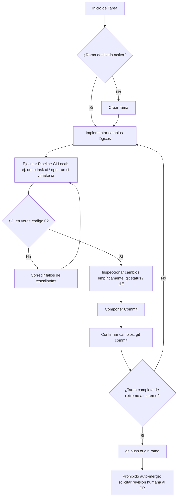

# Git Workflow Mastery — Operaciones Avanzadas y Arquitectura de Control de Versiones

Esta skill dictamina los protocolos operativos de Git de bajo nivel que no están cubiertos directamente por las reglas globales del proyecto.
> **IMPORTANTE:** Las convenciones estructurales (nomenclatura de ramas, Conventional Commits, pipeline CI, PRs) están definidas en las reglas de gobernanza o `AGENTS.md` del proyecto y **no se deben duplicar ni invalidar aquí**. Para teoría y fundamentos de las herramientas usadas, consultar la carpeta [references/](./references/).

---

## 1. Ramas Apiladas (Stacked Branches)

Para evitar el bloqueo por code review, se crean ramas que dependen de otras ramas en vuelo. Esto emula la segmentación de instrucciones (pipelining):
```text
main ──o──o
           \
            A1 ── A2 (Rama feat/caracteristica-a)
                   \
                    B1 ── B2 (Rama feat/caracteristica-b, depende de A)
```

### Receta Operativa: Injerción Topológica con `git rebase --onto`
Uso: Cuando la rama base (`feat/caracteristica-a`) fue modificada o integrada, y necesitas migrar la rama hija (`feat/caracteristica-b`) a la nueva base limpia.

1. **Identificar ancestro de corte:** Localiza el hash del último commit de la rama A antigua del cual partió la rama B (`<ancestro_obsoleto_punta_a>`).
2. **Ejecutar el rebase:**
   ```bash
   git checkout feat/caracteristica-b
   git rebase --onto main <ancestro_obsoleto_punta_a>
   ```
3. **Verificación obligatoria:**
   ```bash
   git log --oneline -n 5
   # Verificar que no haya commits duplicados y que la nueva base sea `main`.
   ```
4. **Recuperación (Manejo de fallos):** Si hay conflictos irresolubles o te equivocaste de ancestro:
   ```bash
   git rebase --abort
   ```

### Receta Operativa: Rebase Apilado Automático con `--update-refs`
Uso: Sincronizar un stack entero de ramas dependientes de un solo golpe.

1. **Ejecutar rebase interactivo en la rama superior:**
   ```bash
   git checkout feat/caracteristica-b
   git rebase -i --update-refs origin/main
   ```
2. **Resolver plan:** Git insertará instrucciones `update-ref` en el editor. Guarda y cierra.
3. **Verificación obligatoria:**
   ```bash
   git log --oneline --graph --all
   # Confirmar que tanto A como B se movieron juntas de forma limpia.
   ```
4. **Recuperación (Manejo de fallos):**
   ```bash
   git rebase --abort
   ```

---

## 2. Operaciones Avanzadas de Git

Consulta [references/herramientas-avanzadas.md](./references/herramientas-avanzadas.md) para la base teórica de estos comandos.

### Ambientes de Desarrollo Concurrentes (`git worktree`)
Uso: Revisión de Pull Requests o tareas paralelas sin interrumpir el entorno local ni usar stashes.

- **Crear un entorno aislado:**
  ```bash
  # Crea la carpeta review-feature un nivel arriba y hace checkout a la rama
  git worktree add ../review-feature origin/feat/nueva-funcionalidad
  ```
- **Verificar:**
  ```bash
  git worktree list
  ```
- **Descartar al finalizar:**
  ```bash
  git worktree remove ../review-feature
  ```

### Memoria de Resolución de Conflictos (`git rerere`)
Uso: Evitar resolver el mismo conflicto idéntico en múltiples rebases repetitivos.

- **Activar globalmente:**
  ```bash
  git config --global rerere.enabled true
  ```
- **Flujo y Verificación:** Tras activarlo, en conflictos futuros Git mostrará `Recorded preimage`. Al resolver y confirmar, mostrará `Recorded resolution`. En rebases subsecuentes, dirá `Resolved 'ruta' using previous resolution`. Verifica el estado interno con:
  ```bash
  git rerere status
  ```

### Auditoría de Reescritura (`git range-diff`)
Uso: Analizar qué cambió entre un rebase o commit modificado con `--amend` y la versión previamente enviada al remoto.

- **Ejecución estándar:**
  ```bash
  git range-diff origin/feat/mi-rama@{1} origin/feat/mi-rama @
  ```
- **Verificación:** Revisar el output ("diff de diffs") para garantizar que no se inyectó código accidental o se perdieron cambios durante la resolución de merge del rebase.

---

## 3. Checklist Visual de Ejecución

> **NOTA:** Las reglas de nomenclatura, formato de commits y CI están definidas estrictamente en el `AGENTS.md`. Aplícalas en todo momento durante este flujo.


