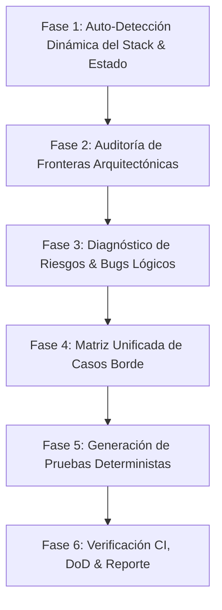

---
name: qa-testing-mastery
description: >-
  Audita suites de pruebas y arquitectura de testing, diagnostica vulnerabilidades, condiciones de carrera
  y bugs lógicos, auto-detecta dinámicamente el stack tecnológico del proyecto (runtime, frameworks, ORM,
  test runners y arquitectura modular como FSD o Clean Architecture), diseña matrices agresivas de casos
  borde (edge cases) y genera suites de pruebas deterministas certificando el pipeline de CI y Definition of Done.
---

# QA & Testing Mastery — Arquitectura de Pruebas, Edge Cases y Resiliencia

Skill especializada en la auditoría exhaustiva de suites de prueba, el diagnóstico de vulnerabilidades y condiciones de carrera, la detección dinámica del stack del proyecto y el diseño sistemático de matrices de casos extremos bajo el paradigma del **Diamante de Pruebas**.

---

## Documentación de Referencia y Módulos de Conocimiento

Para consultar especificaciones técnicas detalladas, recetarios de código y catálogos de patrones, consulta los siguientes módulos:

*   **[Diamante de Pruebas y Persistencia](./references/testing-diamond-framework.md)**: Fundamentos del Diamante de Pruebas, falacia del motor en memoria SQLite vs PostgreSQL/MySQL, aislamiento transaccional con CLS (`cls-hooked`), bloqueos pesimistas (`LOCK.UPDATE`) y gestión de migraciones/fábricas.
*   **[Catálogo de Matrices de Casos Borde](./references/edge-case-matrix-catalog.md)**: Taxonomía de heurísticas de edge cases (límites de datos, concurrencia de mutación, desbordamiento numérico, fallos de red/transacción, deriva de esquemas y saturación de recursos).
*   **[Recetarios de Tecnologías y Código](./references/tech-stacks-recipes.md)**: Patrones de implementación listos para producción con Vitest, Jest, Supertest, Deno Test, Sequelize, Drizzle, Pact.js v3 (CDC), Autocannon y scripts de carga k6 con SLOs.

---

## Flujo de Trabajo en 6 Fases

---

### Fase 1: Auto-Detección Dinámica del Stack & Estado (Zero-Trust)

> [!IMPORTANT]
> **Principio Zero-Trust**: Prohibido asumir el stack o sus versiones. La skill debe auto-inspeccionar primero los manifiestos raíz del proyecto antes de proponer o escribir cualquier prueba.

1.  **Inspección de Manifiestos y Archivos de Configuración**:
    *   `deno.json` / `deno.jsonc` -> Runtime Deno. Inspeccionar `tasks` (`ci`, `test`, `check`, `lint`) e `imports`.
    *   `package.json` -> Runtime Node.js / Bun / pnpm. Inspeccionar `dependencies`, `devDependencies` y `scripts`.
    *   `pyproject.toml` / `requirements.txt` -> Ecosistema Python (pytest, unittest).
    *   `Cargo.toml` / `go.mod` -> Rust / Go.

2.  **Clasificación Automática del Stack**:
    *   **Runtime & Lenguaje**: Deno, Node.js, Bun, Python, Go, Rust (TypeScript/JavaScript).
    *   **Backend & Routing**: Express, Fastify, Hono, NestJS, Oak, Django, FastAPI.
    *   **Capa de Persistencia & ORM**: Drizzle, Sequelize (v6 vs v7), Prisma, TypeORM, SQLAlchemy, SQL raw (`pg`, `mysql2`).
    *   **Test Runner & Aserciones**: Vitest, Jest, `deno test`, Supertest, Pytest.
    *   **Frontend & Estado**: React, Vue, Svelte, TanStack Query, Redux, Zustand.
    *   **Topología Arquitectónica**:
        - *FSD (Feature-Sliced Design)*: Carpetas `app/`, `pages/`, `widgets/`, `features/`, `entities/`, `shared/`.
        - *Clean Architecture / Hexagonal / DDD*: Carpetas `dominio/`, `aplicacion/`, `infraestructura/`, `ports/`.
        - *MVC Tradicional*: `controllers/`, `services/`, `models/`.

3.  **Auditoría de Paridad de Entornos de Persistencia**:
    *   **Verificar si se usa SQLite en memoria para pruebas**: Si producción usa PostgreSQL o MySQL y las pruebas usan `sqlite::memory:`, registrar de inmediato como **Riesgo Crítico de Dialecto** (consultar [testing-diamond-framework.md](./references/testing-diamond-framework.md)).
    *   **Método de Limpieza de BD**: Detectar si la suite usa truncamiento destructivo (`truncate`), migraciones repetitivas lentas o rollback transaccional atómico (`afterEach` con transacción revertida).

---

### Fase 2: Auditoría de Fronteras Arquitectónicas

Antes de evaluar la lógica interna, certificar que la estructura respeta las fronteras modulares:

1.  **Frontend — Feature-Sliced Design (FSD)**:
    *   **Jerarquía de Capas**: `app` -> `pages` -> `widgets` -> `features` -> `entities` -> `shared`. Una capa inferior jamás importa de una superior.
    *   **Prohibición de Cross-Slice Imports**: Un slice en `features/auth` jamás importa directamente de `features/perfil`. La orquestación ocurre en `widgets` o `pages`.
    *   **Prohibición de Deep Imports**: Las importaciones externas a un slice deben pasar exclusivamente por su Public API (`index.ts`). Prohibido `import { ... } from '@/features/auth/ui/LoginForm'`.
    *   **Aislamiento Multi-App**: En monorepos con múltiples portales o SPAs, verificar que no existan dependencias cruzadas entre aplicaciones hermanas.

2.  **Backend — Clean Architecture & Inversión de Dependencias**:
    *   **Dominio Puro**: Cero dependencias hacia librerías externas, frameworks HTTP o drivers de base de datos.
    *   **Capa de Aplicación**: Solo depende de Dominio y expone puertos (interfaces). No conoce implementaciones concretas.
    *   **Capa de Infraestructura**: Implementa los puertos sin filtrar detalles tecnológicos (Drizzle, Sequelize, Express, Hono) hacia el dominio.

---

### Fase 3: Diagnóstico de Riesgos, Vulnerabilidades y Bugs Lógicos

Analizar el código bajo prueba buscando activamente patrones de degradación:

1.  **Condiciones de Carrera y Bloqueos (MVCC)**:
    *   Mutaciones en operaciones concurrentes sobre inventarios, balances, cupones o reservas.
    *   ¿Se usa bloqueo pesimista explícito (`FOR UPDATE`, `transaction.LOCK.UPDATE`) o control de concurrencia optimista (`version` / CAS)?
2.  **Consultas Ineficientes ($N+1$)**:
    *   Iteraciones `map`/`forEach` ejecutando consultas de base de datos individuales en lugar de joins/includes batch.
3.  **Límites Numéricos y Tipado**:
    *   Montos o identificadores que exceden `Number.MAX_SAFE_INTEGER` (`9007199254740991`) sin `BigInt`.
    *   Coerción implícita en parámetros de consulta (strings pasados como booleanos o números sin sanitizar).
4.  **Alineación de Contratos Cliente-Servidor**:
    *   Discrepancias entre esquemas de validación backend (Zod, Joi) y contratos del cliente (React/TypeScript).
    *   Estructuras de respuesta de error inconsistentes.

---

### Fase 4: Matriz Unificada de Ataque de Edge Cases

Al diseñar pruebas para un componente o caso de uso, cubrir sistemáticamente las 6 dimensiones:

| Dimensión | Enfoque de Evaluación | Casos Límite a Diseñar |
| :--- | :--- | :--- |
| **1. Frontera de Entrada (Inputs)** | Controladores, Rutas y Formularios | `null`, `undefined`, `""`, strings con espacios en blanco, inyecciones (`<script>`, SQL/NoSQL), desbordamiento de longitud, emojis, Unicode multibyte, enteros negativos, ceros, `MAX_SAFE_INTEGER`. |
| **2. Concurrencia y Estado** | Transacciones, Servicios y Hooks | Peticiones simultáneas duplicadas (idempotencia), condiciones de carrera en mutaciones, clics rápidos repetidos en UI, invalidación de tokens a mitad de operación. |
| **3. Ciclo de Vida y Red** | Frontend y Clientes HTTP | Respuestas 4xx/5xx, timeouts de red, abortos por desmontaje de componente (*unmounted state updates*), reintentos masivos sin jitter. |
| **4. Contratos y Esquemas** | DTOs, Zod y CDC (Pact) | Payloads con campos omitidos, propiedades adicionales no documentadas, tipos invertidos, colecciones vacías `[]` vs pobladas, discrepancias de fecha ISO 8601. |
| **5. Fronteras de Arquitectura** | FSD y Clean Architecture | Violaciones de importaciones entre slices hermanos, deep-imports fuera de `index.ts`, fugas de infraestructura al dominio. |
| **6. Persistencia y Transaccionalidad** | BD, Repositorios y UnitOfWork | Violación de restricciones de unicidad o clave foránea, caída a mitad de transacción con verificación de rollback integral, transacciones zombi. |

---

### Fase 5: Generación de Pruebas Deterministas (Adaptadas al Stack)

Generar pruebas concretas empleando el patrón idóneo para las tecnologías detectadas en Fase 1:

1.  **Para Node / Express / Sequelize**:
    *   Pruebas de integración en proceso con Supertest (`request(app)`) sin puertos físicos.
    *   Aislamiento ultra-rápido mediante transacciones CLS (`cls-hooked`) y rollback incondicional en `afterEach`.
    *   Consultar recetario en [tech-stacks-recipes.md](./references/tech-stacks-recipes.md#1-suite-de-integración-con-supertest-vitestjest-y-cls-rollbacks).
2.  **Para Deno / Hono / Drizzle**:
    *   Pruebas con `deno test` usando `app.request()` en memoria.
    *   Transacciones de prueba con rollback explícito o base de datos efímera en contenedor con Testcontainers.
3.  **Pruebas de Contrato (CDC) con Pact.js v3**:
    *   Definir interacciones en el consumidor con matchers estructurales (`MatchersV3.like()`, `MatchersV3.eachLike()`).
    *   Verificación en proveedor con *Provider States* para inicializar datos reales.
4.  **Pruebas de Estrés y Carga con k6 / Autocannon**:
    *   Scripts declarando SLOs estrictos: $p(95) < 250\text{ms}$, tasa de error $< 0.5\%$.
5.  **Fábricas Dinámicas**:
    *   Usar `@faker-js/faker` o factorías deterministas en lugar de fixtures estáticas globales que generen colisiones de estado.

---

### Fase 6: Protocolo de Verificación CI, Definition of Done & Reporte

1.  **Ejecución Obligatoria del Pipeline CI**:
    *   Ejecutar la suite configurada en el proyecto (`deno task ci`, `npm run ci`, `pnpm test`, etc.).
    *   Certificar que pasan todos los pasos: formateo/linter, chequeo estático de tipos, suites de tests unitarios/integración y empaquetado/build.

2.  **Definition of Done (DoD)**:
    - [ ] **Stack Identificado**: Runtime, framework, ORM y runner documentados formalmente.
    - [ ] **Cero Errores de Tipos y Compilación**: Compilación limpia con código de retorno 0.
    - [ ] **Fronteras Arquitectónicas Intactas**: Respeto estricto de FSD y Clean Architecture.
    - [ ] **Cobertura de Casos Extremos**: Al menos 3 pruebas de Edge Cases por funcionalidad crítica.
    - [ ] **Aserciones Semánticas**: Validación de estado, payload y efectos secundarios (`toMatchObject`, aserciones de rollback).
    - [ ] **Pipeline Verde**: Suite de CI validada con salida 0.

3.  **Formato de Reporte al Usuario**:
    *   **Resumen del Stack Detectado**: Tecnologías, runner y arquitectura identificados.
    *   **Diagnóstico de Pruebas & Brechas**: Análisis de la suite existente.
    *   **Matriz de Edge Cases Implementados**: Tabla con entradas, comportamiento y aserciones.
    *   **Certificación de CI**: Salida de comandos y confirmación del estado verde.
